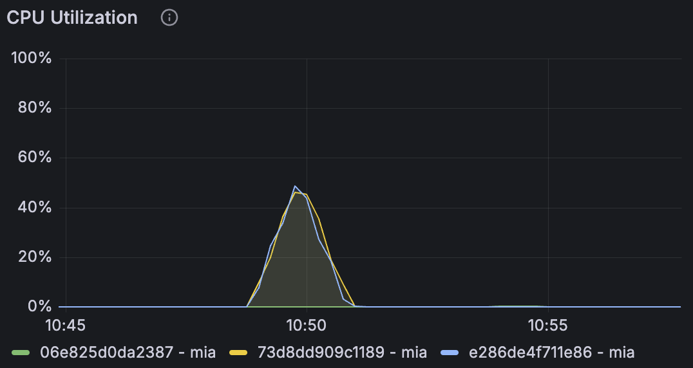
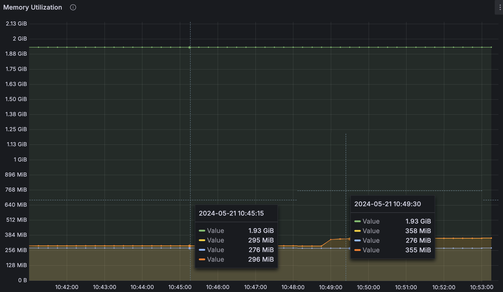

# Scraping Load Testing - Test #1

## Summary

The load test successfully processed 600 requests in 60 seconds with all requests returning HTTP 200 status codes. The average response time was 1380.1 ms, with CPU utilization peaking at around 50% on both machines, indicating sufficient CPU resources. However, there was a significant increase in memory usage post-test, which did not return to pre-test levels, suggesting a potential memory leak. Further investigation and additional load tests are recommended to address this issue and optimize the system's performance.

## Table of Contents

- [Scraping Load Testing - Test #1](#scraping-load-testing---test-1)
  - [Summary](#summary)
  - [Table of Contents](#table-of-contents)
  - [Test environment](#test-environment)
    - [Machines](#machines)
  - [Load #1 - 600 reqs 60 secs (initial load only)](#load-1---600-reqs-60-secs-initial-load-only)
    - [Archillery Report](#archillery-report)
    - [CPU Utilization](#cpu-utilization)
    - [Memory Utilization](#memory-utilization)
  - [Conclusions and Next Steps](#conclusions-and-next-steps)
    - [Conclusions](#conclusions)
    - [Next Steps](#next-steps)

## Test environment
### Machines

| Machine | Size/CPU |
|---|---|
| e286de4f711e86 mia (app) | performance-cpu-1x@2048MB |
| 73d8dd909c1189 mia (app) | performance-cpu-1x@2048MB |

---

## Load #1 - 600 reqs 60 secs (initial load only)

```yml
# load-test.yml
- duration: 60
  arrivalRate: 10  # Initial load
```

### Archillery Report
Date: 10:49:39(-0300)

| Metric                                      | Value   |
|---------------------------------------------|---------|
| http.codes.200                              | 600     |
| http.downloaded_bytes                       | 0       |
| http.request_rate                           | 10/sec  |
| http.requests                               | 600     |
| http.response_time.min                      | 984     |
| http.response_time.max                      | 2267    |
| http.response_time.mean                     | 1380.1  |
| http.response_time.median                   | 1353.1  |
| http.response_time.p95                      | 1755    |
| http.response_time.p99                      | 2059.5  |
| http.responses                              | 600     |
| vusers.completed                            | 600     |
| vusers.created                              | 600     |
| vusers.created_by_name.Scrape a URL         | 600     |
| vusers.failed                               | 0       |
| vusers.session_length.min                   | 1053.7  |
| vusers.session_length.max                   | 2332.6  |
| vusers.session_length.mean                  | 1447.4  |
| vusers.session_length.median                | 1436.8  |
| vusers.session_length.p95                   | 1863.5  |
| vusers.session_length.p99                   | 2143.5  |

### CPU Utilization


Both machines peaked at around 50% CPU utilization.

### Memory Utilization


| Machine | Before | After Load Test |
|---|---|---|
| e286de4f711e86 | 295 MiB | 358 MiB |
| 73d8dd909c1189 | 296 MiB | 355 MiB |

Notice that the memory utilization has not re-stabilished to the pre-test values during the check window, which may indicate a memory leak problem.

---

## Conclusions and Next Steps

### Conclusions
1. **Performance:** The system handled 600 requests in 60 seconds with a mean response time of 1380.1 ms. All requests were successful (HTTP 200).
2. **CPU Utilization:** Both machines peaked at around 50% CPU utilization, indicating that the CPU resources were sufficient for the load.
3. **Memory Utilization:** There was a noticeable increase in memory usage on both machines post-test, and the memory did not re-stabilize to pre-test levels, suggesting a potential memory leak.

### Next Steps
1. **Investigate Memory Leak:** Conduct a detailed analysis to identify and fix the potential memory leak. This may involve profiling the application and reviewing the code for memory management issues.
2. **Additional Load Tests:** Perform additional load tests with varying request rates and durations to further assess the system's performance and stability.
3. **Optimize Performance:** Based on the findings, optimize the application to improve response times and resource utilization.
4. **Monitor in Production:** Implement monitoring in the production environment to ensure that similar issues do not occur under real-world conditions.
5. **Documentation:** Update the documentation with the findings and any changes made to the system as a result of this test.

By following these steps, we can ensure that the system is robust, efficient, and ready to handle production workloads.