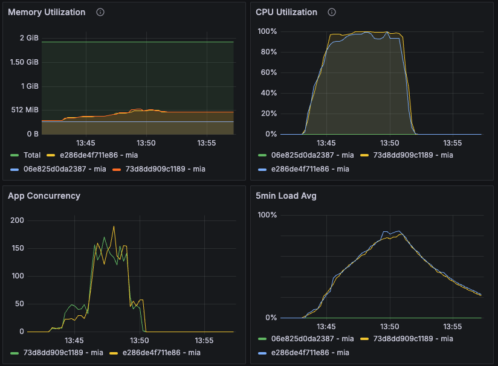

# Scraping Load Testing - Test #2

## Summary

The load test encountered significant issues, processing 9000 requests with 5473 timeouts and a 61.6% failure rate. The average response time was 3682.1 ms, with a peak response time of 9919 ms. Both machines reached 100% CPU utilization, leading to severe performance bottlenecks and high failure rates. This indicates the need for substantial optimizations, autoscaling, and further investigation.

## Table of Contents

- [Scraping Load Testing - Test #2](#scraping-load-testing---test-2)
  - [Summary](#summary)
  - [Table of Contents](#table-of-contents)
  - [Test environment](#test-environment)
    - [Machines](#machines)
  - [Load #2 - 9000 reqs 7 mins 11 secs (4 phases)](#load-2---9000-reqs-7-mins-11-secs-4-phases)
    - [Archillery Report](#archillery-report)
    - [Metrics](#metrics)
  - [Conclusions and Next Steps](#conclusions-and-next-steps)
    - [Conclusions](#conclusions)
    - [Next Steps](#next-steps)

## Test environment
### Machines

| Machine | Size/CPU |
|---|---|
| e286de4f711e86 mia (app) | performance-cpu-1x@2048MB |
| 73d8dd909c1189 mia (app) | performance-cpu-1x@2048MB |

---

## Load #2 - 9000 reqs 7 mins 11 secs (4 phases)

```yml

# load-test.yml
- duration: 60
  arrivalRate: 10  # Initial load
- duration: 120
  arrivalRate: 20  # Increased load
- duration: 180
  arrivalRate: 30  # Peak load
- duration: 60
  arrivalRate: 10  # Cool down
```


### Archillery Report
Date: 13:50:08(-0300)

| Metric                                      | Value   |
|---------------------------------------------|---------|
| errors.ETIMEDOUT                            | 5473    |
| errors.Failed capture or match              | 73      |
| http.codes.200                              | 3454    |
| http.codes.401                              | 64      |
| http.codes.402                              | 9       |
| http.downloaded_bytes                       | 0       |
| http.request_rate                           | 21/sec  |
| http.requests                               | 9000    |
| http.response_time.min                      | 929     |
| http.response_time.max                      | 9919    |
| http.response_time.mean                     | 3682.1  |
| http.response_time.median                   | 3395.5  |
| http.response_time.p95                      | 8024.5  |
| http.response_time.p99                      | 9607.1  |
| http.responses                              | 3527    |
| vusers.completed                            | 3454    |
| vusers.created                              | 9000    |
| vusers.created_by_name.Scrape a URL         | 9000    |
| vusers.failed                               | 5546    |
| vusers.session_length.min                   | 1127.6  |
| vusers.session_length.max                   | 9982.2  |
| vusers.session_length.mean                  | 3730.6  |
| vusers.session_length.median                | 3464.1  |
| vusers.session_length.p95                   | 7865.6  |
| vusers.session_length.p99                   | 9607.1  |

### Metrics



Both machines reached 100% CPU utilization, which led to a significant number of request failures (61.6% failure rate).

---

## Conclusions and Next Steps

### Conclusions
1. **Performance:** The system struggled with 9000 requests, resulting in 5473 timeouts and a mean response time of 3682.1 ms.
2. **CPU Utilization:** Both machines experienced 100% CPU utilization, causing severe performance degradation and high failure rates.

### Next Steps
Implement an autoscaling solution on Fly.io and conduct tests using the same configurations.
