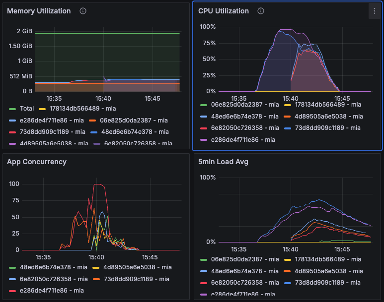

# Scraping Load Testing - Test #4

## Summary

The load test was conducted with the Fly.io configuration set to a hard limit of 100 and a soft limit of 50. The test involved four phases with varying arrival rates. Despite the adjustments, there were 1329 timeouts (14.8%) but no HTTP 502 responses. The average response time was 3547.9 ms, with a peak response time of 9935 ms. Further adjustments to the artillery timeout configuration are recommended to improve performance.

## Table of Contents

- [Scraping Load Testing - Test #4](#scraping-load-testing---test-4)
  - [Summary](#summary)
  - [Table of Contents](#table-of-contents)
  - [Test environment](#test-environment)
    - [Machines](#machines)
  - [Load Test Phases](#load-test-phases)
    - [Configuration](#configuration)
    - [Results](#results)
  - [Metrics](#metrics)
  - [Conclusions and Next Steps](#conclusions-and-next-steps)
    - [Conclusions](#conclusions)
    - [Next Steps](#next-steps)

## Test environment
### Machines

| Machine | Size/CPU | Status |
|---|---|---|
| e286de4f711e86 mia (app) | performance-cpu-1x@2048MB | always on |
| 73d8dd909c1189 mia (app) | performance-cpu-1x@2048MB | always on |
| 6e82050c726358 mia (app) | performance-cpu-1x@2048MB | paused |
| 4d89505a6e5038 mia (app) | performance-cpu-1x@2048MB | paused |
| 48ed6e6b74e378 mia (app) | performance-cpu-1x@2048MB | paused |

---

## Load Test Phases

### Configuration

```toml
# fly.staging.toml
[http_service.concurrency]
  type = "requests"
  hard_limit = 100
  soft_limit = 50
```
```yml
# load-test.yml
- duration: 60
arrivalRate: 10  # Initial load
- duration: 120
arrivalRate: 20  # Increased load
- duration: 180
arrivalRate: 30  # Peak load
- duration: 60
arrivalRate: 10  # Cool down
```


### Results
Date: 15:43:26(-0300)

| Metric                                      | Value   |
|---------------------------------------------|---------|
| errors.ETIMEDOUT                            | 1329    |
| http.codes.200                              | 7671    |
| http.downloaded_bytes                       | 0       |
| http.request_rate                           | 23/sec  |
| http.requests                               | 9000    |
| http.response_time.min                      | 999     |
| http.response_time.max                      | 9935    |
| http.response_time.mean                     | 3547.9  |
| http.response_time.median                   | 2836.2  |
| http.response_time.p95                      | 8352    |
| http.response_time.p99                      | 9607.1  |
| http.responses                              | 7671    |
| vusers.completed                            | 7671    |
| vusers.created                              | 9000    |
| vusers.created_by_name.Scrape a URL         | 9000    |
| vusers.failed                               | 1329    |
| vusers.session_length.min                   | 1063.4  |
| vusers.session_length.max                   | 10006.8 |
| vusers.session_length.mean                  | 3616    |
| vusers.session_length.median                | 2893.5  |
| vusers.session_length.p95                   | 8352    |
| vusers.session_length.p99                   | 9607.1  |

## Metrics



---

## Conclusions and Next Steps

### Conclusions
1. **Performance:** The system handled 9000 requests with a mean response time of 3547.9 ms. There were 1329 timeouts but no HTTP 502 responses.
2. **Response Times:** The peak response time was 9935 ms, indicating that the system struggled under peak load conditions.

### Next Steps
1. **Adjust Timeout Configuration:** Change the artillery timeout configuration to reduce the number of timeouts.
2. **Further Load Tests:** Conduct additional load tests with the new timeout configuration to assess improvements.

By following these steps, we can enhance the system's performance and reliability under varying load conditions.
