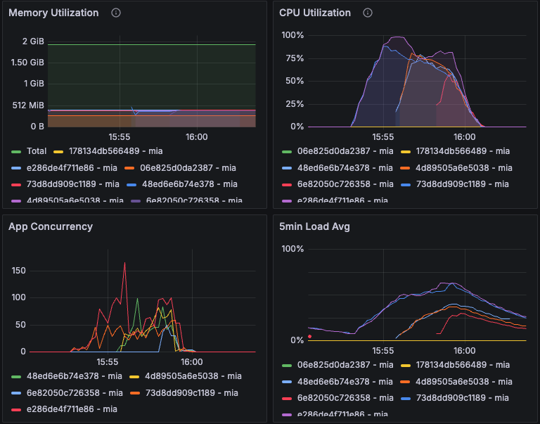

# Scraping Load Testing - Test #5

## Summary

The load test was conducted with a higher timeout configuration to address previous timeout issues. The test involved 9000 requests with a timeout set to 30 seconds. The system handled the load well, with only 4 HTTP 502 responses (0.04%). The average response time was 5661.8 ms, with a peak response time of 18924 ms. Further analysis is recommended to optimize response times.

## Table of Contents

- [Scraping Load Testing - Test #5](#scraping-load-testing---test-5)
  - [Summary](#summary)
  - [Table of Contents](#table-of-contents)
  - [Test environment](#test-environment)
    - [Machines](#machines)
  - [Load Test Configuration](#load-test-configuration)
    - [Configuration](#configuration)
    - [Results](#results)
    - [Metrics](#metrics)
  - [Conclusions and Next Steps](#conclusions-and-next-steps)
    - [Conclusions](#conclusions)
    - [Next Steps](#next-steps)

## Test environment
### Machines

| Machine | Size/CPU | Status |
|---|---|---|
| e286de4f711e86 mia (app) | performance-cpu-1x@2048MB | always on |
| 73d8dd909c1189 mia (app) | performance-cpu-1x@2048MB | always on |
| 6e82050c726358 mia (app) | performance-cpu-1x@2048MB | paused |
| 4d89505a6e5038 mia (app) | performance-cpu-1x@2048MB | paused |
| 48ed6e6b74e378 mia (app) | performance-cpu-1x@2048MB | paused |

---

## Load Test Configuration

### Configuration

```yml
  http:
    timeout: 30
```


### Results
Date: 15:59:50(-0300)

| Metric                                      | Value   |
|---------------------------------------------|---------|
| errors.Failed capture or match              | 4       |
| http.codes.200                              | 8996    |
| http.codes.502                              | 4       |
| http.downloaded_bytes                       | 0       |
| http.request_rate                           | 23/sec  |
| http.requests                               | 9000    |
| http.response_time.min                      | 62      |
| http.response_time.max                      | 18924   |
| http.response_time.mean                     | 5661.8  |
| http.response_time.median                   | 5378.9  |
| http.response_time.p95                      | 11050.8 |
| http.response_time.p99                      | 12968.3 |
| http.responses                              | 9000    |
| vusers.completed                            | 8996    |
| vusers.created                              | 9000    |
| vusers.created_by_name.Scrape a URL         | 9000    |
| vusers.failed                               | 4       |
| vusers.session_length.min                   | 1079.2  |
| vusers.session_length.max                   | 18980.3 |
| vusers.session_length.mean                  | 5734.4  |
| vusers.session_length.median                | 5487.5  |
| vusers.session_length.p95                   | 11050.8 |
| vusers.session_length.p99                   | 12968.3 |

### Metrics



---

## Conclusions and Next Steps

### Conclusions
1. **Performance:** The system handled 9000 requests with a mean response time of 5661.8 ms. There were only 4 HTTP 502 responses which represent a 0.04% failure rate.
2. **Response Times:** The peak response time was 18924 ms, indicating that while the system handled the load, there is room for optimization.

### Next Steps

2. **Testing Scraping Strategies:** Conduct further testing on the Playwright instance to ensure it can handle increased load and identify any potential bottlenecks.
3. **Load Testing Other Functionalities:** Evaluate the performance of other critical routes, such as the crawl route, through additional load tests to ensure comprehensive system reliability.
4. **Optimize Response Times:** Investigate and implement strategies to reduce the peak response time from 18924 ms. This could involve optimizing database queries, improving server configurations, or enhancing caching mechanisms.
5. **Error Handling Improvements:** Analyze the causes of the 4 HTTP 502 responses and implement robust error handling and recovery mechanisms to minimize such occurrences in future tests.
6. **Scalability Assessment:** Assess the system's scalability by gradually increasing the load beyond 9000 requests to determine its breaking point and plan for necessary infrastructure upgrades.

By following these steps, we can further enhance the system's performance and reliability under varying load conditions.
