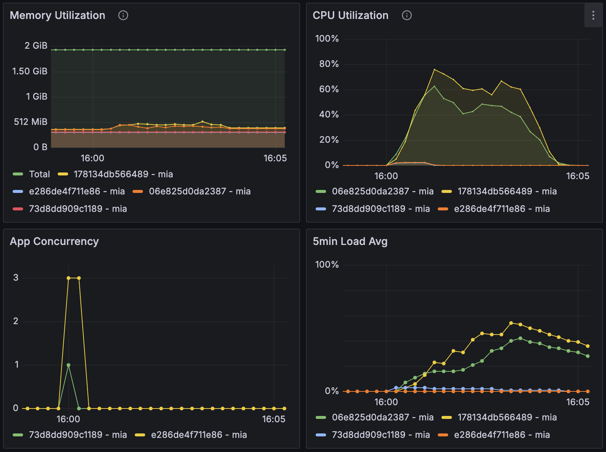

# Load Testing Crawl Routes - Test #6

## Summary

The load test was conducted with a duration of 10 minutes and an arrival rate of 10 requests per second. The system handled the load well, with no failed requests. The average response time was 838.1 ms, with a peak response time of 1416 ms. Further analysis is recommended to optimize response times and assess the impact of higher loads.

## Table of Contents

- [Load Testing Crawl Routes - Test #6](#load-testing-crawl-routes---test-6)
  - [Summary](#summary)
  - [Table of Contents](#table-of-contents)
  - [Test environment](#test-environment)
    - [Machines](#machines)
  - [Load Test Configuration](#load-test-configuration)
    - [Configuration](#configuration)
    - [Results](#results)
    - [Metrics](#metrics)
  - [Conclusions and Next Steps](#conclusions-and-next-steps)
    - [Conclusions](#conclusions)
    - [Next Steps](#next-steps)

## Test environment
### Machines

| Machine | Size/CPU | Status |
|---|---|---|
| 06e825d0da2387 mia (worker) | performance-cpu-1x@2048MB | always on |
| 178134db566489 mia (worker) | performance-cpu-1x@2048MB | always on |
| 73d8dd909c1189 mia (app) | performance-cpu-1x@2048MB | always on |
| e286de4f711e86 mia (app) | performance-cpu-1x@2048MB | always on |

Other app machines with autoscaling shouldn't start during crawl tests.

---

## Load Test Configuration

### Configuration

```yml
# load-test.yml
  - duration: 10
    arrivalRate: 10
```


### Results
Date: 16:00:06(-0300)

| Metric                                      | Value   |
|---------------------------------------------|---------|
| http.codes.200                              | 200     |
| http.downloaded_bytes                       | 0       |
| http.request_rate                           | 10/sec  |
| http.requests                               | 200     |
| http.response_time.min                      | 687     |
| http.response_time.max                      | 1416    |
| http.response_time.mean                     | 838.1   |
| http.response_time.median                   | 788.5   |
| http.response_time.p95                      | 1085.9  |
| http.response_time.p99                      | 1274.3  |
| http.responses                              | 200     |
| vusers.completed                            | 100     |
| vusers.created                              | 100     |
| vusers.created_by_name.Crawl a URL          | 100     |
| vusers.failed                               | 0       |
| vusers.session_length.min                   | 11647.5 |
| vusers.session_length.max                   | 12310   |
| vusers.session_length.mean                  | 11812.7 |
| vusers.session_length.median                | 11734.2 |
| vusers.session_length.p95                   | 11971.2 |
| vusers.session_length.p99                   | 12213.1 |

### Metrics




**CPU Utilization:**
- **App machines:** Less than 2.3% CPU utilization with no changes in memory utilization.
- **Worker machines:** High CPU utilization for over 4 minutes and 45 seconds, with 56% (peaking at 75.8%) on 178134db566489 and 40% (peaking at 62.7%) on 06e825d0da2387.

**Memory Utilization:**
- **App machines:** No relevant changes during the tests.
- **Worker machines:** 
  - 06e825d0da2387: From 359MiB to over 388MiB during 4 minutes and 45 seconds (peaking at 461MiB).
  - 178134db566489: From 366MiB to over 449MiB during 4 minutes and 45 seconds (peaking at 523MiB).


---

## Conclusions and Next Steps

### Conclusions
1. **Performance:** The system handled 200 requests with a mean response time of 838.1 ms. There were no failed requests.
2. **Response Times:** The peak response time was 1416 ms, indicating that while the system handled the load, there is room for optimization.

### Next Steps

1. **Higher Load Testing:** Conduct further testing with higher loads to assess the system's performance under increased stress.
2. **Optimize Response Times:** Investigate and implement strategies to reduce the peak response time from 1416 ms. This could involve optimizing database queries, improving server configurations, or enhancing caching mechanisms.
3. **Scalability Assessment:** Assess the system's scalability by gradually increasing the load beyond the current configuration to determine its breaking point and plan for necessary infrastructure upgrades.

By following these steps, we can further enhance the system's performance and reliability under varying load conditions.