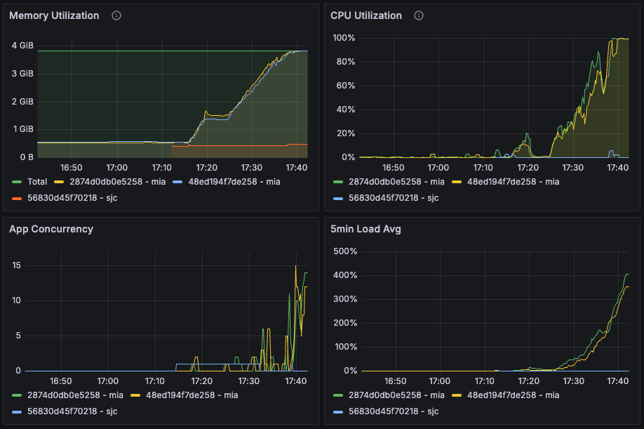
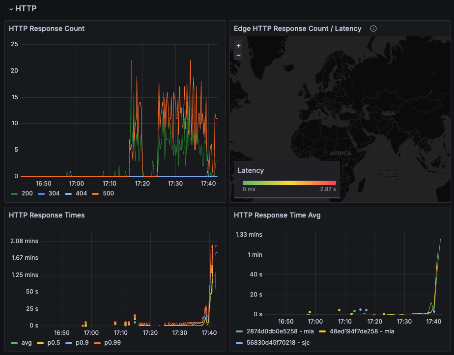
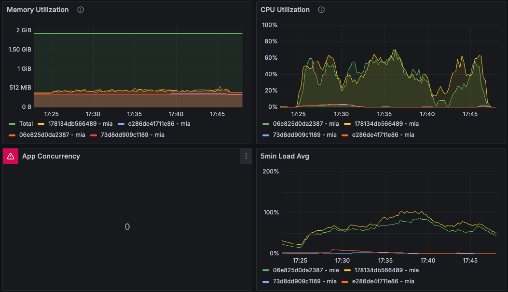

# Load Testing Crawl Routes - Test #7

## Summary

This load test, conducted over a period of 7 minutes with an extended observation, aimed to evaluate the system's performance under variable loads. Although the system was able to queue all requests successfully and no requests failed, the test was prematurely terminated due to a critical failure in the fire-engine machines after 22 minutes. This incident revealed significant vulnerabilities in handling sustained loads, specifically related to resource management.

## Table of Contents

- [Load Testing Crawl Routes - Test #7](#load-testing-crawl-routes---test-7)
  - [Summary](#summary)
  - [Table of Contents](#table-of-contents)
  - [Test environment](#test-environment)
    - [Machines](#machines)
  - [Load Test Configuration](#load-test-configuration)
    - [Configuration](#configuration)
    - [Results](#results)
    - [Metrics](#metrics)
  - [Conclusions and Next Steps](#conclusions-and-next-steps)
    - [Conclusions](#conclusions)
    - [Next Steps](#next-steps)

## Test environment
### Machines

| Machine | Size/CPU | Status |
|---|---|---|
| 06e825d0da2387 mia (worker) | performance-cpu-1x@2048MB | always on |
| 178134db566489 mia (worker) | performance-cpu-1x@2048MB | always on |
| 73d8dd909c1189 mia (app) | performance-cpu-1x@2048MB | always on |
| e286de4f711e86 mia (app) | performance-cpu-1x@2048MB | always on |

fire-engine machines:
| Machine | Size/CPU | Status |
|---|---|---|
| 2874d0db0e5258 mia app | performance-cpu-2x@4096MB | always on |
| 48ed194f7de258 mia app | performance-cpu-2x@4096MB | always on |
| 56830d45f70218 sjc app | performance-cpu-2x@4096MB | initialized during the test |

---

## Load Test Configuration

### Configuration

```yml
phases:
  - duration: 60
    arrivalRate: 1  # Initial load
  - duration: 120
    arrivalRate: 2  # Increased load
  - duration: 180
    arrivalRate: 3  # Peak load
  - duration: 60
    arrivalRate: 1  # Cool down
```

using fire-engine as default scraping strategy

```yml
NUM_WORKERS_PER_QUEUE=8
```

### Results
Date: 17:31:33(-0300)

| Metric                                      | Value   |
|---------------------------------------------|---------|
| http.codes.200                              | 1800    |
| http.downloaded_bytes                       | 0       |
| http.request_rate                           | 3/sec   |
| http.requests                               | 1800    |
| http.response_time.min                      | 711     |
| http.response_time.max                      | 5829    |
| http.response_time.mean                     | 849.2   |
| http.response_time.median                   | 804.5   |
| http.response_time.p95                      | 1043.3  |
| http.response_time.p99                      | 1274.3  |
| http.responses                              | 1800    |
| vusers.completed                            | 900     |
| vusers.created                              | 900     |
| vusers.created_by_name.Crawl a URL          | 900     |
| vusers.failed                               | 0       |
| vusers.session_length.min                   | 11637   |
| vusers.session_length.max                   | 16726.1 |
| vusers.session_length.mean                  | 11829.5 |
| vusers.session_length.median                | 11734.2 |
| vusers.session_length.p95                   | 12213.1 |
| vusers.session_length.p99                   | 12213.1 |

### Metrics





**CPU Utilization:**
- **Fire-engine mia machines:** Reached 100% after 22 minutes of processing the queue. The sjc machine was not requested during the test.
- **Worker machines:** Maintained CPU utilization above 71% during the load testing time.

**Memory Utilization:**
- **Fire-engine mia machines:** utilization reached 100% after 22 minutes of processing the queue.
- **Worker machines:** Maintained Memory utilization above 700MiB during the test.


---

## Conclusions and Next Steps

### Conclusions

1. **Request Handling:** The system effectively managed to queue all requests, demonstrating its capability to handle the initial setup of traffic without any failures.
2. **Critical Failures:** The abrupt failure of the fire-engine machines part-way through the test underscores a significant stability issue, directly impacting the ability to continue operations under load.
3. **Resource Management Deficiencies:** The failure was linked to insufficient resource management, particularly memory handling, which necessitates immediate attention to prevent future disruptions.

### Next Steps
1. **Increase Workers per Machine:** The number of workers per worker machine will be increased from 8 to 12. This change aims to enhance the processing capability of each machine, potentially reducing response times and handling larger volumes of requests more efficiently.

2. **Implement Autoscaling:** Introduce autoscaling capabilities to dynamically adjust the number of active machines based on the current load. This will help in maintaining optimal performance and prevent system overloads by automatically scaling resources up during peak demands and down during low usage periods.

3. **Enhanced Resource Management:** With the increase in workers and the implementation of autoscaling, it is crucial to optimize resource management strategies. This involves improving memory handling and cleanup processes to ensure that resource allocation and recovery are efficient and effective, particularly under sustained high loads.

4. **Extended Duration Testing:** Conduct further tests with extended durations to evaluate the impact of the increased number of workers and autoscaling on system stability and performance. These tests should focus on assessing how well the system sustains operational efficiency over longer periods and under varying load conditions.

5. **Monitor and Optimize:** Continuously monitor system performance during the new tests, particularly focusing on the effects of the increased worker count and autoscaling. Use the gathered data to optimize configurations and troubleshoot any new issues that arise, ensuring the system is fine-tuned for both high performance and reliability.

By following these steps, we can further enhance the system's performance and reliability under varying load conditions.