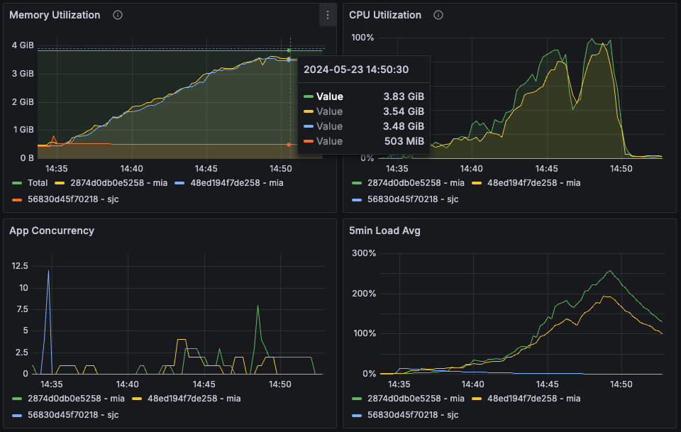
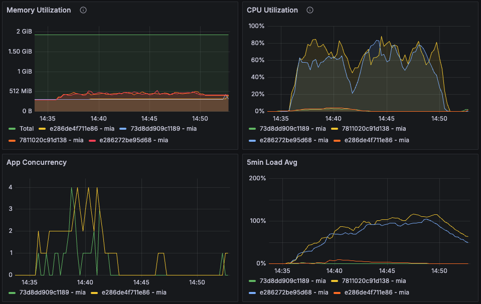

# Load Testing Crawl Routes - Test #8

## Summary

This load test, conducted over a period of 7 minutes with an extended observation, aimed to evaluate the system's performance under variable loads. The test revealed that while the system managed to handle the initial load effectively, there were issues with autoscaling and resource management that need to be addressed.

## Table of Contents

- [Load Testing Crawl Routes - Test #8](#load-testing-crawl-routes---test-8)
  - [Summary](#summary)
  - [Table of Contents](#table-of-contents)
  - [Load Test Configuration](#load-test-configuration)
    - [Configuration](#configuration)
    - [Results](#results)
    - [Metrics](#metrics)
  - [Conclusions and Next Steps](#conclusions-and-next-steps)
    - [Conclusions](#conclusions)
    - [Next Steps](#next-steps)

## Load Test Configuration

### Configuration


| Machine | Size/CPU | Status |
|---|---|---|
| 73d8dd909c1189 mia (app) | performance-cpu-1x@2048MB | always on |
| e286de4f711e86 mia (app) | performance-cpu-1x@2048MB | always on |
| 178134db566489 mia (worker) | performance-cpu-1x@2048MB | always on |
| 7811020c91d138 mia (worker) | performance-cpu-1x@2048MB | always on
178134db566489 mia (worker) | performance-cpu-1x@2048MB | stopped
| 06e825d0da2387 mia (worker) | performance-cpu-1x@2048MB | stopped |

fire-engine machines:
| Machine | Size/CPU | Status |
|---|---|---|
| 2874d0db0e5258 mia app | performance-cpu-2x@4096MB | always on |
| 48ed194f7de258 mia app | performance-cpu-2x@4096MB | always on |
| 56830d45f70218 sjc app | performance-cpu-2x@4096MB | always on |

```yml
phases:
    - duration: 60
      arrivalRate: 1  # Initial load
    - duration: 120
      arrivalRate: 2  # Increased load
    - duration: 180
      arrivalRate: 3  # Peak load
    - duration: 60
      arrivalRate: 1  # Cool down
```

using fire-engine as default scraping strategy

```yml
NUM_WORKERS_PER_QUEUE=12
```

### Results
Date: 14:42:27(-0300)

| Metric                                      | Value   |
|---------------------------------------------|---------|
| errors.Failed capture or match              | 43      |
| http.codes.200                              | 1757    |
| http.codes.404                              | 43      |
| http.downloaded_bytes                       | 0       |
| http.request_rate                           | 3/sec   |
| http.requests                               | 1800    |
| http.response_time.min                      | 363     |
| http.response_time.max                      | 6065    |
| http.response_time.mean                     | 847.8   |
| http.response_time.median                   | 804.5   |
| http.response_time.p95                      | 1130.2  |
| http.response_time.p99                      | 1353.1  |
| http.responses                              | 1800    |
| vusers.completed                            | 857     |
| vusers.created                              | 900     |
| vusers.created_by_name.Crawl a URL          | 900     |
| vusers.failed                               | 43      |
| vusers.session_length.min                   | 11598.4 |
| vusers.session_length.max                   | 17005.3 |
| vusers.session_length.mean                  | 11854.1 |
| vusers.session_length.median                | 11734.2 |
| vusers.session_length.p95                   | 12213.1 |
| vusers.session_length.p99                   | 12459.8 |

### Metrics




**CPU Utilization:**
- **Fire-engine mia machines:** Reached 99% after 16 minutes of processing the queue, but dropped to 0% after the queue was fully processed. The sjc machine was not requested during the 
- **Worker machines:** Maintained CPU utilization above 89% during the load testing time. The higher CPU value indicates an accurate maximum number of workers/machine (12). Other worker machines were not autoscaled for solving the queue as spected.

**Memory Utilization:**
- **Fire-engine mia machines:** utilization reached 92% after 16 minutes of processing the queue.
- **Worker machines:** Maintained Memory utilization above 650MiB during the test.

## Conclusions and Next Steps

### Conclusions

1. **Request Handling:** The system effectively managed to queue all requests, demonstrating its capability to handle the initial setup of traffic without any failures.
2. **Autoscaling Issues:** The other worker machines should have been turned on, but the autoscaling strategy did not work as expected.
3. **Resource Management:** The system maintained high CPU and memory utilization, indicating efficient use of resources, but the autoscaling failure needs to be addressed.

### Next Steps

1. **Investigate Autoscaling:** Investigate why the autoscaling strategy did not work properly and ensure that additional worker machines are turned on as needed.
2. **Optimize Autoscaling:** Implement and test improvements to the autoscaling strategy to ensure it dynamically adjusts the number of active machines based on the current load.
3. **Extended Duration Testing:** Conduct further tests with extended durations to evaluate the impact of the improved autoscaling strategy on system stability and performance.
4. **Monitor and Optimize:** Continuously monitor system performance during the new tests, focusing on the effects of the autoscaling improvements. Use the gathered data to optimize configurations and troubleshoot any new issues that arise.

By following these steps, we can further enhance the system's performance and reliability under varying load conditions.
