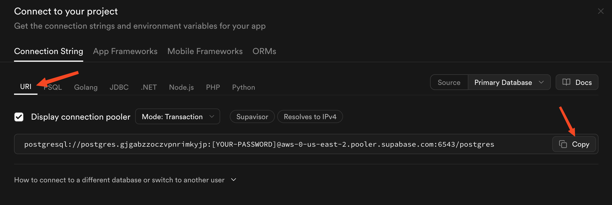
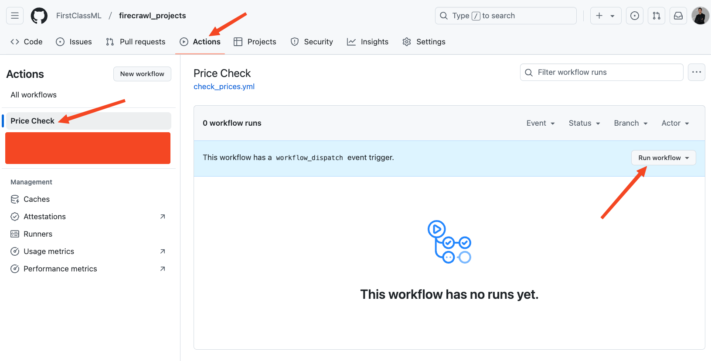
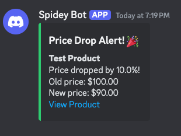
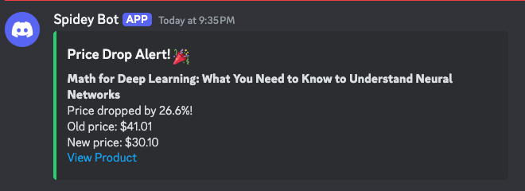

## That sends alerts to your phone and keeps price history

## What Shall We Build in This Tutorial?

There is a lot to be said about the psychology of discounts. For example, buying a discounted item we don't need isn't saving money at all - it's falling for one of the oldest sales tactics. However, there are legitimate cases where waiting for a price drop on items you actually need makes perfect sense.

The challenge is that e-commerce websites run flash sales and temporary discounts constantly, but these deals often disappear as quickly as they appear. Missing these brief windows of opportunity can be frustrating.

That's where automation comes in. In this guide, we'll build a Python application that monitors product prices across any e-commerce website and instantly notifies you when prices drop on items you're actually interested in. Here is a sneak peek of the app:


The app has a simple appearance but provides complete functionality:

- It has a minimalistic UI to add or remove products from the tracker
- A simple dashboard to display price history for each product
- Controls for setting the price drop threshold in percentages
- A notification system that sends Discord alerts when a tracked item's price drops
- A scheduling system that updates the product prices on an interval you specify
- Runs for free for as long as you want

Even though the title says "Amazon price tracker" (full disclosure: I was forced to write that for SEO purposes), the app will work for any e-commerce website you can imagine (except Ebay, for some reason).

So, let's get started building this Amazon price tracker.

## The Toolstack We Will Use

The app will be built using Python and these libraries::

- [Streamlit](streamlit.io) for the UI
- [Firecrawl](firecrawl.dev) for AI-based scraping of e-commerce websites
- [SQLAlchemy](https://www.sqlalchemy.org/) for database management

In addition to Python, we will use these platforms:

- Discord for notifications
- GitHub for hosting the app
- GitHub Actions for running the app on a schedule
- Supabase for hosting a free Postgres database instance

## Building an Amazon Price Tracker App Step-by-step

Since this project involves multiple components working together, we'll take a top-down approach rather than building individual pieces first. This approach makes it easier to understand how everything fits together, since we'll introduce each tool only when it's needed. The benefits of this strategy will become clear as we progress through the tutorial.

### Step 1: Setting up the environment

First, let's create a dedicated environment on our machines to work on the project:

```bash
mkdir automated-price-tracker
cd automated-price-tracker
python -m venv .venv
source .venv/bin/activate
```

These commands create a working directory and activate a virtual environment. Next, create a new script called `ui.py` for designing the user interface with Streamlit.

```bash
touch ui.py
```

Then, install Streamlit:

```bash
pip install streamlit
```

Next, create a `requirements.txt` file and add Streamlit as the first dependency:

```bash
touch requirements.txt
echo "streamlit\n" >> requirements.txt
```

Since the code will be hosted on GitHub, we need to initialize Git and create a `.gitignore` file:

```bash
git init
touch .gitignore
echo ".venv" >> .gitignore  # Add the virtual env folder
git commit -m "Initial commit"
```

### Step 2: Add a sidebar to the UI for product input

Let's take a look at the final product one more time:


It has two sections: the sidebar and the main dashboard. Since the first thing you do when launching this app is adding products, we will start building the sidebar first. Open `ui.py` and paste the following code:

```python
import streamlit as st

# Set up sidebar
with st.sidebar:
    st.title("Add New Product")
    product_url = st.text_input("Product URL")
    add_button = st.button("Add Product")

# Main content
st.title("Price Tracker Dashboard")
st.markdown("## Tracked Products")
```

The code snippet above sets up a basic Streamlit web application with two main sections. In the sidebar, it creates a form for adding new products with a text input field for the product URL and an "Add Product" button. The main content area contains a dashboard title and a section header for tracked products. The code uses Streamlit's `st.sidebar` context manager to create the sidebar layout and basic Streamlit components like `st.title`, `st.text_input`, and `st.button` to build the user interface elements.

To see how this app looks like, run the following command:

```bash
streamlit run ui.py
```

Now, let's add a commit to save our progress:

```bash
git add .
git commit -m "Add a sidebar to the basic UI"
```

### Step 3: Add a feature to check if input URL is valid

In the next step, we want to add some restrictions to the input field like checking if the passed URL is valid. For this, create a new file called `utils.py` where we write additional utility functions for our app:

```bash
touch utils.py
```

Inside the script, paste following code:

```bash
# utils.py
from urllib.parse import urlparse
import re


def is_valid_url(url: str) -> bool:
    try:
        # Parse the URL
        result = urlparse(url)

        # Check if scheme and netloc are present
        if not all([result.scheme, result.netloc]):
            return False

        # Check if scheme is http or https
        if result.scheme not in ["http", "https"]:
            return False

        # Basic regex pattern for domain validation
        domain_pattern = (
            r"^[a-zA-Z0-9]([a-zA-Z0-9-]{0,61}[a-zA-Z0-9])?(\.[a-zA-Z]{2,})+$"
        )
        if not re.match(domain_pattern, result.netloc):
            return False

        return True

    except Exception:
        return False
```

The above function `is_valid_url()` validates URLs by checking several criteria:

1. It verifies the URL has both a scheme (`http`/`https`) and domain name
2. It ensures the scheme is specifically `http` or `https`
3. It validates the domain name format using regex to check for valid characters and TLD
4. It returns True only if all checks pass, False otherwise

Let's use this function in our `ui.py` file. Here is the modified code:

```python
import streamlit as st
from utils import is_valid_url


# Set up sidebar
with st.sidebar:
    st.title("Add New Product")
    product_url = st.text_input("Product URL")
    add_button = st.button("Add Product")

    if add_button:
        if not product_url:
            st.error("Please enter a product URL")
        elif not is_valid_url(product_url):
            st.error("Please enter a valid URL")
        else:
            st.success("Product is now being tracked!")

# Main content
...
```

Here is what's new:

1. We added URL validation using the `is_valid_url()` function from `utils.py`
2. When the button is clicked, we perform validation:
   - Check if URL is empty
   - Validate URL format using `is_valid_url()`
3. User feedback is provided through error/success messages:
   - Error shown for empty URL
   - Error shown for invalid URL format
   - Success message when URL passes validation

Rerun the Streamlit app again and see if our validation works. Then, return to your terminal to commit the changes we've made:

```bash
git add .
git commit -m "Add a feature to check URL validity"
```

### Step 4: Scrape the input URL for product details

When a valid URL is entered and the add button is clicked, we need to implement product scraping functionality instead of just showing a success message. The system should:

1. Immediately scrape the product URL to extract key details:
   - Product name
   - Current price
   - Main product image
   - Brand name
   - Other relevant attributes

2. Store these details in a database to enable:
   - Regular price monitoring
   - Historical price tracking
   - Price change alerts
   - Product status updates

For the scraper, we will use [Firecrawl](firecrawl.dev), an AI-based scraping API for extracting webpage data without HTML parsing. This solution provides several advantages:

1. No website HTML code analysis required for element selection
2. Resilient to HTML structure changes through AI-based element detection
3. Universal compatibility with product webpages due to structure-agnostic approach
4. Reliable website blocker bypass via robust API infrastructure

First, create a new file called `scraper.py`:

```bash
touch scraper.py
```

Then, install these three libraries:

```bash
pip install firecrawl-py pydantic python-dotenv
echo "firecrawl-py\npydantic\npython-dotenv\n" >> requirements.txt  # Add them to dependencies
```

`firecrawl-py` is the Python SDK for Firecrawl scraping engine, `pydantic` is a data validation library that helps enforce data types and structure through Python class definitions, and `python-dotenv` is a library that loads environment variables from a `.env` file into your Python application.

With that said, head over to the Firecrawl website and [sign up for a free account](https://www.firecrawl.dev/) (the free plan will work fine). You will be given an API key, which you should copy.

Then, create a `.env` file in your terminal and add the API key as an environment variable:

```bash
touch .env
echo "FIRECRAWL_API_KEY='YOUR-API-KEY-HERE' >> .env"
echo ".env" >> .gitignore  # Ignore .env files in Git
```

The `.env` file is used to securely store sensitive configuration values like API keys that shouldn't be committed to version control. By storing the Firecrawl API key in `.env` and adding it to `.gitignore`, we ensure it stays private while still being accessible to our application code. This is a security best practice to avoid exposing credentials in source control.

Now, we can start writing the `scraper.py`:

```python
from firecrawl import FirecrawlApp
from pydantic import BaseModel, Field
from dotenv import load_dotenv
from datetime import datetime

load_dotenv()

app = FirecrawlApp()
```

Here, `load_dotenv()` function reads the `.env` file you have in your working directory and loads the environment variables inside, including the Firecrawl API key. When you create an instance of `FirecrawlApp` class, the API key is automatically detected to establish a connection between your script and the scraping engine in the form of the `app` variable.

Now, we create a Pydantic class (usually called a model) that defines the details we want to scrape from each product:

```python
class Product(BaseModel):
    """Schema for creating a new product"""

    url: str = Field(description="The URL of the product")
    name: str = Field(description="The product name/title")
    price: float = Field(description="The current price of the product")
    currency: str = Field(description="Currency code (USD, EUR, etc)")
    main_image_url: str = Field(description="The URL of the main image of the product")
```

Pydantic models may be completely new to you, so let's break down the `Product` model:

- The `url` field stores the product page URL we want to track
- The `name` field stores the product title/name that will be scraped
- The `price` field stores the current price as a float number
- The `currency` field stores the 3-letter currency code (e.g. USD, EUR)
- The `main_image_url` field stores the URL of the product's main image

Each field is typed and has a description that documents its purpose. The `Field` class from Pydantic allows us to add metadata like descriptions to each field. These descriptions are especially important for Firecrawl since it uses them to automatically locate the relevant HTML elements containing the data we want.

Now, let's create a function to call the engine to scrape URL's based on the schema above:

```python
def scrape_product(url: str):
    extracted_data = app.scrape_url(
        url,
        params={
            "formats": ["extract"],
            "extract": {"schema": Product.model_json_schema()},
        },
    )

    # Add the scraping date to the extracted data
    extracted_data["extract"]["timestamp"] = datetime.utcnow()

    return extracted_data["extract"]


if __name__ == "__main__":
    product = "https://www.amazon.com/gp/product/B002U21ZZK/"

    print(scrape_product(product))
```

The code above defines a function called `scrape_product` that takes a URL as input and uses it to scrape product information. Here's how it works:

The function calls `app.scrape_url` with two parameters:

1. The product URL to scrape
2. A params dictionary that configures the scraping:
   - It specifies we want to use the "extract" format
   - It provides our `Product` Pydantic model schema as the extraction template as a JSON object

The scraper will attempt to find and extract data that matches our Product schema fields - the URL, name, price, currency, and image URL.

The function returns just the "extract" portion of the scraped data, which contains the structured product information. `extract` returns a dictionary to which we add the date of the scraping as it will be important later on.

Let's test the script by running it:

```bash
python scraper.py
```

You should get an output like this:

```python
{
    'url': 'https://www.amazon.com/dp/B002U21ZZK', 
    'name': 'MOVA Globe Earth with Clouds 4.5"', 
    'price': 212, 
    'currency': 'USD', 
    'main_image_url': 'https://m.media-amazon.com/images/I/41bQ3Y58y3L._AC_.jpg', 
    'timestamp': '2024-12-05 13-20'
}
```

The output shows that a [MOVA Globe](https://www.amazon.com/dp/B002U21ZZK) costs $212 USD on Amazon at the time of writing this article. You can test the script for any other website that contains the information we are looking (except Ebay):

- Price
- Product name/title
- Main image URL

One key advantage of using Firecrawl is that it returns data in a consistent dictionary format across all websites. Unlike HTML-based scrapers like BeautifulSoup or Scrapy which require custom code for each site and can break when website layouts change, Firecrawl uses AI to understand and extract the requested data fields regardless of the underlying HTML structure.

Finish this step by committing the new changes to Git:

```bash
git add .
git commit -m "Implement a Firecrawl scraper for products"
```

### Step 5: Storing new products in a PostgreSQL database

If we want to check product prices regularly, we need to have an online database. In this case, Postgres is the best option since it's reliable, scalable, and has great support for storing time-series data like price histories.

There are many platforms for hosting Postgres instances but the one I find the easiest and fastest to set up is Supabase. So, please head over to [the Supabase website](https://supabase.com) and create your free account. During the sign-up process, you will be given a password, which you should save somewhere safe on your machine.

Then, in a few minutes, your free Postgres instance comes online. To connect to this instance, click on Home in the left sidebar and then, "Connect":



You will be shown your database connection string with a placeholder for the password you copied. You should paste this string in your `.env` file with your password added to the `.env` file:

```bash
echo POSTGRES_URL="THE-SUPABASE-URL-STRING-WITH-YOUR-PASSWORD-ADDED"
```

Now, the easiest way to interact with this database is through SQLAlchemy. Let's install it:

```bash
pip install "sqlalchemy==2.0.35" psycopg2-binary
echo "psycopg2-binary\nsqlalchemy==2.0.35\n" >> requirements.txt
```

> Note: [SQLAlchemy](https://sqlalchemy.org) is a Python SQL toolkit and Object-Relational Mapping (ORM) library that lets us interact with databases using Python code instead of raw SQL. For our price tracking project, it provides essential features like database connection management, schema definition through Python classes, and efficient querying capabilities. This makes it much easier to store and retrieve product information and price histories in our Postgres database.

After the installation, create a new `database.py` file for storing database-related functions:

```bash
touch database.py
```

Let's populate this script:

```python
from sqlalchemy import create_engine, Column, String, Float, DateTime, ForeignKey
from sqlalchemy.orm import sessionmaker, relationship, declarative_base
from datetime import datetime

Base = declarative_base()


class Product(Base):
    __tablename__ = "products"

    url = Column(String, primary_key=True)
    prices = relationship(
        "PriceHistory", back_populates="product", cascade="all, delete-orphan"
    )


class PriceHistory(Base):
    __tablename__ = "price_histories"

    id = Column(String, primary_key=True)
    product_url = Column(String, ForeignKey("products.url"))
    name = Column(String, nullable=False)
    price = Column(Float, nullable=False)
    currency = Column(String, nullable=False)
    main_image_url = Column(String)
    timestamp = Column(DateTime, nullable=False)
    product = relationship("Product", back_populates="prices")

```

The code above defines two SQLAlchemy models for our price tracking database:

The `Product` model acts as a registry of all items we want to track. It's kept simple with just the URL as we don't want to duplicate data that changes over time.
  
The `PriceHistory` model stores the actual price data points and product details at specific moments in time. This separation allows us to:

- Track how product details (name, price, image) change over time
- Maintain a clean historical record for each product
- Efficiently query price trends without loading unnecessary data

Each record in `PriceHistory` contains:

- A unique ID as primary key
- The product URL as a foreign key linking to the `Product`
- The product name
- The price value and currency
- The main product image URL
- A timestamp of when the price was recorded

The relationship between `Product` and `PriceHistory` is bidirectional, allowing easy navigation between related records. The `cascade` setting ensures price histories are deleted when their product is deleted.

These models provide the structure for storing and querying our price tracking data in a PostgreSQL database using SQLAlchemy's ORM capabilities.

Now, we define a `Database` class with a singe `add_product` method:

```python
class Database:
    def __init__(self, connection_string):
        self.engine = create_engine(connection_string)
        Base.metadata.create_all(self.engine)
        self.Session = sessionmaker(bind=self.engine)

    def add_product(self, url):
        session = self.Session()
        try:
            # Create the product entry
            product = Product(url=url)
            session.merge(product)  # merge will update if exists, insert if not
            session.commit()
        finally:
            session.close()
```

The `Database` class above provides core functionality for managing product data in our PostgreSQL database. It takes a connection string in its constructor to establish the database connection using SQLAlchemy.

The `add_product` method allows us to store new product URLs in the database. It uses SQLAlchemy's `merge` functionality which intelligently handles both inserting new products and updating existing ones, preventing duplicate entries.

The method carefully manages database sessions, ensuring proper resource cleanup by using `try`/`finally` blocks. This prevents resource leaks and maintains database connection stability.

Let's use this method inside the sidebar of our UI. Switch to `ui.py` and make the following adjustments:

First, update the imports to load the Database class and initialize it:

```python
import os
import streamlit as st

from utils import is_valid_url
from database import Database
from dotenv import load_dotenv

load_dotenv()

with st.spinner("Loading database..."):
    db = Database(os.getenv("POSTGRES_URL"))
```

The code integrates the `Database` class into the Streamlit UI by importing required dependencies and establishing a database connection. The database URL is loaded securely from environment variables using `python-dotenv`. The `Database` class creates or updates the tables we specified in `database.py` after being initialized.

The database initialization process is wrapped in a Streamlit spinner component to maintain responsiveness while establishing the connection. This provides visual feedback during the connection setup period, which typically requires a brief initialization time.

Then, in the sidebar code, we only need to add a single line of code to add the product to the database if the URL is valid:

```python
# Set up sidebar
with st.sidebar:
    st.title("Add New Product")
    product_url = st.text_input("Product URL")
    add_button = st.button("Add Product")

    if add_button:
        if not product_url:
            st.error("Please enter a product URL")
        elif not is_valid_url(product_url):
            st.error("Please enter a valid URL")
        else:
            db.add_product(product_url)  # This is the new line
            st.success("Product is now being tracked!")
```

In the final `else` block that runs when the product URL is valid, we call the `add_product` method to store the product in the database.

Let's commit everything:

```bash
git add .
git commit -m "Add a Postgres database integration for tracking product URLs"
```

### Step 6: Storing price histories for new products

Now, after the product is added to the `products` table, we want to add its details and its scraped price to the `price_histories` table.

First, switch to `database.py` and add a new method for creating entries in the `PriceHistories` table:

```python
class Database:
    ...  # the rest of the class

    def add_price(self, product_data):
        session = self.Session()
        try:
            price_history = PriceHistory(
                id=f"{product_data['url']}_{product_data['timestamp']}",
                product_url=product_data["url"],
                name=product_data["name"],
                price=product_data["price"],
                currency=product_data["currency"],
                main_image_url=product_data["main_image_url"],
                timestamp=product_data["timestamp"],
            )
            session.add(price_history)
            session.commit()
        finally:
            session.close()
```

The `add_price` method takes a dictionary containing product data (which is returned by our scraper) and creates a new entry in the `PriceHistory` table. The entry's ID is generated by combining the product URL with a timestamp. The method stores essential product information like name, price, currency, image URL, and the timestamp of when the price was recorded. It uses SQLAlchemy's session management to safely commit the new price history entry to the database.

Now, we need to add this functionality to the sidebar as well. In `ui.py`, add a new import statement that loads the `scrape_product` function from `scraper.py`:

```python
...  # The rest of the imports
from scraper import scrape_product
```

Then, update the `else` block in the sidebar again:

```python
with st.sidebar:
    st.title("Add New Product")
    product_url = st.text_input("Product URL")
    add_button = st.button("Add Product")

    if add_button:
        if not product_url:
            st.error("Please enter a product URL")
        elif not is_valid_url(product_url):
            st.error("Please enter a valid URL")
        else:
            db.add_product(product_url)
            with st.spinner("Added product to database. Scraping product data..."):
                product_data = scrape_product(product_url)
                db.add_price(product_data)
            st.success("Product is now being tracked!")
```

Now when a user enters a product URL and clicks the "Add Product" button, several things happen:

1. The URL is validated to ensure it's not empty and is properly formatted.
2. If valid, the URL is added to the products table via `add_product()`.
3. The product page is scraped immediately to get current price data.
4. This initial price data is stored in the price history table via `add_price()`.
5. The user sees loading spinners and success messages throughout the process.

This gives us a complete workflow for adding new products to track, including capturing their initial price point. The UI provides clear feedback at each step and handles errors gracefully.

Check that everything is working the way we want it and then, commit the new changes:

```bash
git add .
git commit -m "Add a feature to track product prices after they are added"
```

### Step 7: Displaying each product's price history in the main dashboard

Let's take a look at the final product shown in the introduction once again:


Apart from the sidebar, the main dashboard shows each product's price history visualized with a Plotly line plot where the X axis is the timestamp while the Y axis is the prices. Each line plot is wrapped in a Streamlit component that includes buttons for removing the product from the database or visiting its source URL.

In this step, we will implement the plotting feature and leave the two buttons for a later section. First, add a new method to the `Database` class for retrieving the price history for each product:

```python
class Database:
    ...  # The rest of the code

    def get_price_history(self, url):
        """Get price history for a product"""
        session = self.Session()
        try:
            return (
                session.query(PriceHistory)
                .filter(PriceHistory.product_url == url)
                .order_by(PriceHistory.timestamp.desc())
                .all()
            )
        finally:
            session.close()
```

The method queries the price histories table based on product URL, orders the rows in descending order (oldest first) and returns the results.

Then, add another method for retrieving all products from the `products` table:

```python
class Database:
    ...
    
    def get_all_products(self):
        session = self.Session()
        try:
            return session.query(Product).all()
        finally:
            session.close()
```

The idea is that every time our Streamlit app is opened, the main dashboard queries all existing products from the database and render their price histories with line charts in dedicated components.

To create the line charts, we need Plotly and Pandas, so install them in your environment:

```bash
pip install pandas plotly
echo "pandas\nplotly\n" >> requirements.txt
```

Afterward, import them at the top of `ui.py` along with other existing imports:

```python
import pandas as pd
import plotly.express as px
```

Then, switch to `ui.py` and paste the following snippet of code after the Main content section:

```python
# Main content
st.title("Price Tracker Dashboard")
st.markdown("## Tracked Products")

# Get all products
products = db.get_all_products()
```

Here, after the page title and subtitle is shown, we are retrieving all products from the database. Let's loop over them:

```python
# Create a card for each product
for product in products:
    price_history = db.get_price_history(product.url)
    if price_history:
        # Create DataFrame for plotting
        df = pd.DataFrame(
            [
                {"timestamp": ph.timestamp, "price": ph.price, "name": ph.name}
                for ph in price_history
            ]
        )
```

For each product, we get their price history with `db.get_price_history` and then, convert this data into a dataframe with three columns:

- Timestamp
- Price
- Product name

This makes plotting easier with Plotly. Next, we create a Streamlit expander component for each product:

```python
# Create a card for each product
for product in products:
    price_history = db.get_price_history(product.url)
    if price_history:
        ...
        # Create a card-like container for each product
        with st.expander(df["name"][0], expanded=False):
            st.markdown("---")
            col1, col2 = st.columns([1, 3])

            with col1:
                if price_history[0].main_image_url:
                    st.image(price_history[0].main_image_url, width=200)
                st.metric(
                    label="Current Price",
                    value=f"{price_history[0].price} {price_history[0].currency}",
                )
```

The expander shows the product name as its title and contains:

1. A divider line
2. Two columns:
   - Left column: Product image (if available) and current price metric
   - Right column (shown in next section)

The price is displayed using Streamlit's metric component which shows the current price and currency.

Here is the rest of the code:

```python
            ...
            
            with col2:
                # Create price history plot
                fig = px.line(
                    df,
                    x="timestamp",
                    y="price",
                    title=None,
                )
                fig.update_layout(
                    xaxis_title=None,
                    yaxis_title="Price",
                    showlegend=False,
                    margin=dict(l=0, r=0, t=0, b=0),
                    height=300,
                )
                fig.update_xaxes(tickformat="%Y-%m-%d %H:%M", tickangle=45)
                fig.update_yaxes(tickprefix=f"{price_history[0].currency} ", tickformat=".2f")
                st.plotly_chart(fig, use_container_width=True)
```

In the right column, we create an interactive line plot using Plotly Express to visualize the price history over time. The plot shows price on the y-axis and timestamp on the x-axis. The layout is customized to remove the title, adjust axis labels and formatting, and optimize the display size. The timestamps are formatted to show date and time, with angled labels for better readability. Prices are displayed with 2 decimal places and a dollar sign prefix. The plot is rendered using Streamlit's `plotly_chart` component and automatically adjusts its width to fill the container.

After this step, the UI must be fully functional and ready to track products. For example, here is what mine looks like after adding a couple of products:


But notice how the price history chart doesn't show anything. That's because we haven't populated it by checking the product price in regular intervals. Let's do that in the next couple of steps. For now, commit the latest changes we've made:

```bash
git add .
git commit -m "Display product price histories for each product in the dashboard"
```

------------

Let's take a brief moment to summarize the steps we took so far and what's next. So far, we've built a Streamlit interface that allows users to add product URLs and displays their current prices and basic information. We've implemented the database schema, created functions to scrape product data, and designed a clean UI with price history visualization. The next step is to set up automated price checking to populate our history charts and enable proper price tracking over time.

### Step 8: Adding new price entries for existing products

Now, we want to write a script that adds new price entries in the `price_histories` table for each product in `products` table. We call this script `check_prices.py`:

```python
import os
from database import Database
from dotenv import load_dotenv
from firecrawl import FirecrawlApp
from scraper import scrape_product

load_dotenv()

db = Database(os.getenv("POSTGRES_URL"))
app = FirecrawlApp()
```

At the top, we are importing the functions and packages and initializing the database and a Firecrawl app. Then, we define a simple `check_prices` function:

```python
def check_prices():
    products = db.get_all_products()

    for product in products:
        try:
            updated_product = scrape_product(product.url)
            db.add_price(updated_product)
            print(f"Added new price entry for {updated_product['name']}")
        except Exception as e:
            print(f"Error processing {product.url}: {e}")


if __name__ == "__main__":
    check_prices()
```

In the function body, we retrieve all products URLs, retrieve their new price data with `scrape_product` function from `scraper.py` and then, add a new price entry for the product with `db.add_price`.

If you run the function once and refresh the Streamlit app, you must see a line chart appear for each product you are tracking:


Let's commit the changes in this step:

```bash
git add .
git commit -m "Add a script for checking prices of existing products"
```

### Step 9: Check prices regularly with GitHub actions

GitHub Actions is a continuous integration and continuous delivery (CI/CD) platform that allows you to automate various software workflows directly from your GitHub repository. In our case, it's particularly useful because we can set up automated price checks to run the `check_prices.py` script at regular intervals (e.g., daily or hourly) without manual intervention. This ensures we consistently track price changes and maintain an up-to-date database of historical prices for our tracked products.

So, the first step is creating a new GitHub repository for our project and pushing existing code to it:

```bash
git remote add origin https://github.com/yourusername/price-tracker.git
git push origin main
```

Then, return to your terminal and create this directory structure:

```bash
mkdir -p .github/workflows
touch .github/workflows/check_prices.yml
```

The first command creates a new directory structure `.github/workflows` using the `-p` flag to create parent directories if they don't exist.

The second command creates an empty YAML file called `check_prices.yml` inside the workflows directory. GitHub Actions looks for workflow files in this specific location - any YAML files in the `.github/workflows` directory will be automatically detected and processed as workflow configurations. These YAML files define when and how your automated tasks should run, what environment they need, and what commands to execute. In our case, this file will contain instructions for GitHub Actions to periodically run our price checking script. Let's write it:

```yaml
name: Price Check

on:
  schedule:
    # Runs every 3 minutes
    - cron: "*/3 * * * *"
  workflow_dispatch: # Allows manual triggering
```

Let's break down this first part of the YAML file:

The `name: Price Check` line gives our workflow a descriptive name that will appear in the GitHub Actions interface.

The `on:` section defines when this workflow should be triggered. We've configured two triggers:

1. A schedule using cron syntax `*/3 * * * *` which runs the workflow every 3 minutes. The five asterisks represent minute, hour, day of month, month, and day of week respectively. The `*/3` means "every 3rd minute". The 3-minute interval is for debugging purposes, we will need to choose a wider interval later on to respect the free limits of GitHub actions.

2. `workflow_dispatch` enables manual triggering of the workflow through the GitHub Actions UI, which is useful for testing or running the check on-demand.

Now, let's add the rest:

```yaml
jobs:
  check-prices:
    runs-on: ubuntu-latest

    steps:
      - name: Checkout code
        uses: actions/checkout@v4

      - name: Set up Python
        uses: actions/setup-python@v5
        with:
          python-version: "3.10"
          cache: "pip"

      - name: Install dependencies
        run: |
          python -m pip install --upgrade pip
          pip install -r requirements.txt

      - name: Run price checker
        env:
          FIRECRAWL_API_KEY: ${{ secrets.FIRECRAWL_API_KEY }}
          POSTGRES_URL: ${{ secrets.POSTGRES_URL }}
        run: python check_prices.py
```

Let's break down this second part of the YAML file:

The `jobs:` section defines the actual work to be performed. We have one job named `check-prices` that runs on an Ubuntu virtual machine (`runs-on: ubuntu-latest`).

Under `steps:`, we define the sequence of actions:

1. First, we checkout our repository code using the standard `actions/checkout@v4` action

2. Then we set up Python 3.10 using `actions/setup-python@v5`, enabling pip caching to speed up dependency installation

3. Next, we install our Python dependencies by upgrading `pip` and installing requirements from our `requirements.txt` file. At this point, it is essential that you were keeping a complete dependency file based on the installs we made in the project.

4. Finally, we run our price checker script, providing two environment variables:
   - `FIRECRAWL_API_KEY`: For accessing the web scraping service
   - `POSTGRES_URL`: For connecting to our database

Both variables must be stored in our GitHub repository as secrets for this workflow file to run without errors. So, navigate to the repository you've created for the project and open its Settings. Under "Secrets and variables" > "Actions", click on "New repository secret" button to add the environment variables we have in the `.env` file one-by-one.

Then, return to your terminal, commit the changes and push:

```bash
git add . 
git commit -m "Add a workflow to check prices regularly"
git push origin main
```

Next, navigate to your GitHub repository again and click on the "Actions" tab:



From there, you can run the workflow manually (click "Run workflow" and refresh the page). If it is executed successfully, you can return to the Streamlit app and refresh to see the new price added to the chart.

### Step 10: Setting up Discord for notifications

Now that we know our scheduling workflow works, the first order of business is setting a wider check interval in the workflow file. Even though our first workflow run was manually, the rest happen automatically.

```bash
on:
  schedule:
    # Runs every 6 hours
    - cron: "0 0,6,12,18 * * *"
  workflow_dispatch: # Allows manual triggering
```

The cron syntax `0 0,6,12,18 * * *` can be broken down as follows:

- First `0`: Run at minute 0
- `0,6,12,18`: Run at hours 0 (midnight), 6 AM, 12 PM (noon), and 6 PM
- First `*`: Run every day of the month
- Second `*`: Run every month
- Third `*`: Run every day of the week

So this schedule will check prices four times daily: at midnight, 6 AM, noon, and 6 PM (UTC time). This spacing helps stay within GitHub Actions' free tier limits while still catching most price changes.

Now, commit and push the changes:

```bash
git add .
git commit -m "Set a wider check interval in the workflow file"
git push origin main
```

Now comes the interesting part. Each time the workflow is run, we want to compare the current price of the product to its original price when we started tracking it. If the difference between these two prices exceeds a certain threshold like 5%, this means there is a discount happening for the product and we want to send a notification.

The easiest way to set this up is by using Discord webhooks. So, if you don't have one already, go to Discord.com and create a new account (optionally, download the desktop app as well). Then, setting up Discord notifications requires a few careful steps:

1. **Create a discord server**
   - Click the "+" button in the bottom-left corner of Discord
   - Choose "Create My Own" → "For me and my friends"
   - Give your server a name (e.g., "Price Alerts")

2. **Create a channel for alerts**
   - Your server comes with a #general channel by default
   - You can use this or create a new channel called #price-alerts
   - Right-click the channel you want to use

3. **Set up the webhook**
   - Select "Edit Channel" from the right-click menu
   - Go to the "Integrations" tab
   - Click "Create Webhook"
   - Give it a name like "Price Alert Bot"
   - The webhook URL will be generated automatically
   - Click "Copy Webhook URL" - this is your unique notification endpoint

4. **Secure the webhook URL**
   - Never share or commit your webhook URL directly
   - Add it to your `.env` file as `DISCORD_WEBHOOK_URL`
   - Add it to your GitHub repository secrets
   - The URL should look something like: `https://discord.com/api/webhooks/...`

This webhook will serve as a secure endpoint that our price tracker can use to send notifications directly to your Discord channel.

Webhooks are automated messages sent from apps to other apps in real-time. They work like a notification system - when something happens in one app, it automatically sends data to another app through a unique URL. In our case, we'll use Discord webhooks to automatically notify us when there's a price drop. Whenever our price tracking script detects a significant discount, it will send a message to our Discord channel through the webhook URL, ensuring we never miss a good deal.

After copying the webhook URL, you should save it as environment variable to your `.env` file:

```python
echo "DISCORD_WEBHOOK_URL='THE-URL-YOU-COPIED'" >> .env
```

Now, create a new file called `notifications.py` and paste the following contents:

```python
from dotenv import load_dotenv
import os
import aiohttp
import asyncio

load_dotenv()


async def send_price_alert(
    product_name: str, old_price: float, new_price: float, url: str
):
    """Send a price drop alert to Discord"""
    drop_percentage = ((old_price - new_price) / old_price) * 100

    message = {
        "embeds": [
            {
                "title": "Price Drop Alert! 🎉",
                "description": f"**{product_name}**\nPrice dropped by {drop_percentage:.1f}%!\n"
                f"Old price: ${old_price:.2f}\n"
                f"New price: ${new_price:.2f}\n"
                f"[View Product]({url})",
                "color": 3066993,
            }
        ]
    }

    try:
        async with aiohttp.ClientSession() as session:
            await session.post(os.getenv("DISCORD_WEBHOOK_URL"), json=message)
    except Exception as e:
        print(f"Error sending Discord notification: {e}")
```

The `send_price_alert` function above is responsible for sending price drop notifications to Discord using webhooks. Let's break down what's new:

1. The function takes 4 parameters:
   - `product_name`: The name of the product that dropped in price
   - `old_price`: The previous price before the drop
   - `new_price`: The current lower price
   - `url`: Link to view the product

2. It calculates the percentage drop in price using the formula: `((old_price - new_price) / old_price) * 100`

3. The notification is formatted as a Discord embed - a rich message format that includes:
   - A title with a celebration emoji
   - A description showing the product name, price drop percentage, old and new prices
   - A link to view the product
   - A green color (3066993 in decimal)

4. The message is sent asynchronously using `aiohttp` to post to the Discord webhook URL stored in the environment variables

5. Error handling is included to catch and print any issues that occur during the HTTP request

This provides a clean way to notify users through Discord whenever we detect a price drop for tracked products.

To check the notification system works, add this main block to the end of the script:

```python
if __name__ == "__main__":
    asyncio.run(send_price_alert("Test Product", 100, 90, "https://www.google.com"))
```

`asyncio.run()` is used here because `send_price_alert` is an async function that needs to be executed in an event loop. `asyncio.run()` creates and manages this event loop, allowing the async HTTP request to be made properly. Without it, we wouldn't be able to use the `await` keyword inside `send_price_alert`.

To run the script, install `aiohttp`:

```python
pip install aiohttp
echo "aiohttp\n" >> requirements.txt
python notifications.py
```

If all is well, you should get a Discord message in your server that looks like this:



Let's commit the changes we have:

```bash
git add .
git commit -m "Set up Discord alert system"
```

Also, don't forget to add the Discord webhook URL to your GitHub repository secrets!

### Step 11: Sending Discord alerts when prices drop

Now, the only step left is adding a price comparison logic to `check_prices.py`. In other words, we want to use the `send_price_alert` function if the new scraped price is lower than the original. This requires a revamped `check_prices.py` script:

```python
import os
import asyncio
from database import Database
from dotenv import load_dotenv
from firecrawl import FirecrawlApp
from scraper import scrape_product
from notifications import send_price_alert

load_dotenv()

db = Database(os.getenv("POSTGRES_URL"))
app = FirecrawlApp()

# Threshold percentage for price drop alerts (e.g., 5% = 0.05)
PRICE_DROP_THRESHOLD = 0.05


async def check_prices():
    products = db.get_all_products()
    product_urls = set(product.url for product in products)

    for product_url in product_urls:
        # Get the price history
        price_history = db.get_price_history(product_url)
        if not price_history:
            continue

        # Get the earliest recorded price
        earliest_price = price_history[-1].price

        # Retrieve updated product data
        updated_product = scrape_product(product_url)
        current_price = updated_product["price"]

        # Add the price to the database
        db.add_price(updated_product)
        print(f"Added new price entry for {updated_product['name']}")

        # Check if price dropped below threshold
        if earliest_price > 0:  # Avoid division by zero
            price_drop = (earliest_price - current_price) / earliest_price
            if price_drop >= PRICE_DROP_THRESHOLD:
                await send_price_alert(
                    updated_product["name"], earliest_price, current_price, product_url
                )


if __name__ == "__main__":
    asyncio.run(check_prices())
```

Let's examine the key changes in this enhanced version of `check_prices.py`:

1. New imports and setup
   - Added `asyncio` for `async`/`await` support
   - Imported `send_price_alert` from `notifications.py`
   - Defined `PRICE_DROP_THRESHOLD = 0.05` (5% threshold for alerts)

2. Async function conversion
   - Converted `check_prices()` to async function
   - Gets unique product URLs using set comprehension to avoid duplicates

3. Price history analysis
   - Retrieves full price history for each product
   - Gets `earliest_price` from `history[-1]` (works because we ordered by timestamp DESC)
   - Skips products with no price history using `continue`

4. Price drop detection logic
   - Calculates drop percentage: `(earliest_price - current_price) / earliest_price`
   - Checks if drop exceeds 5% threshold
   - Sends Discord alert if threshold exceeded using `await send_price_alert()`

5. Async main block
   - Uses `asyncio.run()` to execute async `check_prices()` in event loop

When I tested this new version of the script, I immediately got an alert:



Before we supercharge our workflow with the new notification system, you should add this line of code to your `check_prices.yml` workflow file to read the Discord webhook URL from your GitHub secrets:

```python
...
    - name: Run price checker
        env:
          FIRECRAWL_API_KEY: ${{ secrets.FIRECRAWL_API_KEY }}
          POSTGRES_URL: ${{ secrets.POSTGRES_URL }}
          DISCORD_WEBHOOK_URL: ${{ secrets.DISCORD_WEBHOOK_URL }}
        run: python automated_price_tracking/check_prices.py
```

Finally, let's commit everything and push to GitHub so that our workflow is supercharged with our notification system:

```bash
git add .
git commit -m "Add notification system to price drops"
git push origin main
```

## Limitations of Free Tier Tools Used in the Tutorial

Before wrapping up, let's quickly review the limitations of the free tools we used in this tutorial:

- GitHub Actions: Limited to 2,000 minutes per month for free accounts. Consider increasing the cron interval to stay within limits.
- Supabase: Free tier includes 500MB database storage and limited row count. Monitor usage if tracking many products.
- Firecrawl: Free API tier allows 500 requests per month. This means that at 6 hour intervals, you can track up to four products in the free plan.
- Streamlit Cloud: Free hosting tier has some memory/compute restrictions and goes to sleep after inactivity.

While these limitations exist, they're quite generous for personal use and learning. The app will work well for tracking a reasonable number of products with daily price checks.

## Conclusion and Next Steps

Congratulations for making it to the end of this extremely long tutorial! We've just covered how to implement an end-to-end Python project you can proudly showcase on your portfolio. We built a complete price tracking system that scrapes product data from e-commerce websites, stores it in a Postgres database, analyzes price histories, and sends automated Discord notifications when prices drop significantly. Along the way, we learned about web scraping with Firecrawl, database management with SQLAlchemy, asynchronous programming with asyncio, building interactive UIs with Streamlit, automating with GitHub actions and integrating external webhooks.

However, the project is far from perfect. Since we took a top-down approach to building this app, our project code is scattered across multiple files and often doesn't follow programming best practices. For this reason, I've recreated the same project in a much more sophisticated manner with production-level features. [This new version on GitHub](https://github.com/BexTuychiev/automated-price-tracking) implements proper database session management, faster operations and overall smoother user experience. Also, this version includes buttons for removing products from the database and visiting them through the app.

If you decide to stick with the basic version, you can find the full project code and notebook in [the official Firecrawl GitHub repository's example projects](https://github.com/mendableai/firecrawl/tree/main/examples/automated_price_tracking). I also recommend that you [deploy your Streamlit app to Streamlit Cloud](https://share.streamlit.io) so that you have a functional app accessible everywhere you go.

Here are some further improvements you might consider for the app:

- Improve the price comparison logic: the app compares the current price to the oldest recorded price, which might not be ideal. You may want to compare against recent price trends instead.
- No handling of currency conversion if products use different currencies.
- The Discord notification system doesn't handle rate limits or potential webhook failures gracefully.
- No error handling for Firecrawl scraper - what happens if the scraping fails?
- No consistent usage of logging to help track issues in production.
- No input URL sanitization before scraping.

Some of these features are implemented in [the advanced version of the project](https://github.com/BexTuychiev/automated-price-tracking), so definitely check it out!

Here are some more guides from our blog if you are interested:

- [How to Run Web Scrapers on Schedule](https://www.firecrawl.dev/blog/automated-web-scraping-free-2025)
- [More about using Firecrawl's `scrape_url` function](https://www.firecrawl.dev/blog/mastering-firecrawl-scrape-endpoint)
- [Scraping entire websites with Firecrawl in a single command - the /crawl endpoint](https://www.firecrawl.dev/blog/mastering-the-crawl-endpoint-in-firecrawl)

Thank you for reading!
