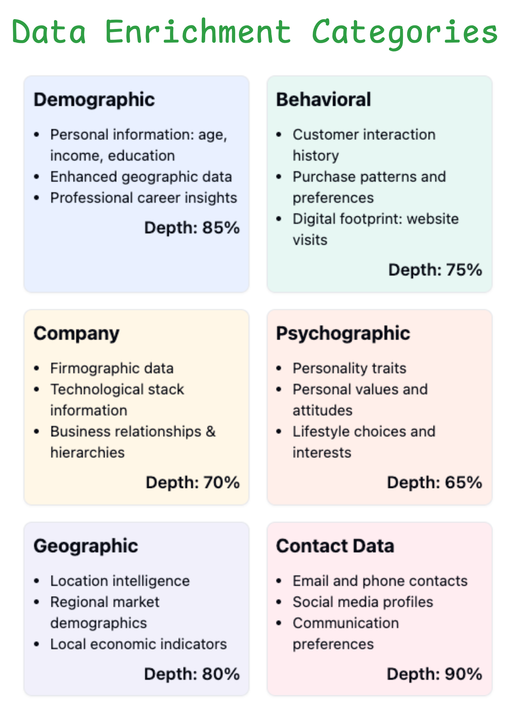

## Introduction

In today's data-driven business landscape, organizations face a critical challenge: transforming raw data into actionable insights. Data enrichment has emerged as a fundamental process that enables businesses to enhance their existing datasets with additional, valuable information from multiple sources.

This comprehensive guide explores data enrichment — what it is, why it matters, and how organizations can implement it effectively. Whether you're looking to improve customer profiles, enhance marketing campaigns, or strengthen decision-making processes, understanding data enrichment is crucial for maintaining a competitive edge in the near future.

As data sources continue to multiply and diversify, businesses need robust tools and strategies to collect, integrate, and enhance their data efficiently. Modern solutions, including AI-powered platforms like [Firecrawl](https://firecrawl.dev), are transforming how organizations approach data enrichment by automating collection processes and ensuring data quality at scale.

Throughout this guide, we'll explore:

- Essential concepts and methodologies in data enrichment
- Tools and technologies that streamline the enrichment process
- Best practices for implementing data enrichment strategies
- Real-world applications and success stories
- Common challenges and their solutions

Whether you're new to data enrichment or looking to optimize your existing processes, this guide provides the insights and practical knowledge needed to enhance your data quality and drive better business outcomes.

## What is Data Enrichment?

Data enrichment is the process of enhancing, refining, and augmenting existing data by combining it with relevant information from multiple sources. This process transforms basic data points into comprehensive, actionable insights that drive better business decisions.

### Understanding data enrichment tools

Modern data enrichment tools automate the complex process of collecting and integrating data from diverse sources. These tools typically offer:

- Automated data collection from websites, APIs, and databases
- Data validation and cleaning capabilities
- Schema mapping and transformation features
- Integration with existing business systems
- Quality assurance and monitoring

For example, web scraping engines like Firecrawl enable organizations to automatically structured web data through AI-powered extraction, eliminating the need for manual data gathering while ensuring consistency and accuracy. We will see a complete Firecrawl data enrichment workflow later.

### Types of data enrichment services

Data enrichment services generally fall into six main categories:



1. **Demographic**
   - Adding personal information like age, income, education
   - Enhancing geographic data with location-specific insights
   - Including professional and career-related information

2. **Behavioral**
   - Incorporating customer interaction history
   - Adding purchase patterns and preferences
   - Including digital footprint data like website visits and engagement

3. **Company**
   - Adding firmographic data (company size, revenue, industry)
   - Including technological stack information
   - Incorporating business relationships and hierarchies

4. **Psychographic**
   - Adding personality traits and characteristics
   - Including personal values and attitudes
   - Incorporating lifestyle choices and interests
   - Adding motivation and decision-making patterns

5. **Geographic**
   - Location intelligence and spatial analysis
   - Regional market data and demographics
   - Geographic business opportunities
   - Local economic indicators
   - Competitive landscape by region

6. **Contact Data**
   - Email addresses and phone numbers
   - Social media profiles
   - Professional contact details
   - Business communication preferences
   - Contact verification and validation

These different types of data enrichment services can be combined and integrated to create comprehensive data profiles. For example, combining demographic and behavioral data provides deeper customer insights, while merging company and geographic data enables better B2B market analysis. The key is selecting the right combination of enrichment types based on your specific business needs and objectives.

As we move into examining B2B data enrichment specifically, we'll see how these various enrichment types come together to support business decision-making and growth strategies.

### B2B data enrichment fundamentals

B2B data enrichment focuses specifically on enhancing business-related information to improve lead generation, account-based marketing, and sales processes. Key aspects include:

- Company verification and validation
- Decision-maker identification and contact information
- Industry classification and market positioning
- Technology stack and tool usage data
- Company financial health indicators (e.g., revenue ranges $1-10M, $10-50M, etc.)
- Organizational structure and hierarchy details
- Employee count brackets (e.g., 1-50, 51-200, 201-1000)

The effectiveness of B2B data enrichment relies heavily on:

- Data accuracy and freshness through diverse data sources
- Real-time enrichment for time-sensitive data vs. batch processing for static data
- Compliance with data protection regulations
- Integration with existing CRM and sales tools
- Scalability of enrichment processes
- Cost-effectiveness and validation across multiple data providers

These fundamentals form the foundation for successful B2B data enrichment initiatives. When implemented effectively, they enable organizations to make more informed business decisions and develop targeted strategies for growth.

Let's explore the various tools and services available for data enrichment and how to select the right ones for your needs.

## Data Enrichment Tools and Services

Data enrichment tools come in various forms, each serving specific use cases and industries. Here are some of the most effective solutions:

1. Web scraping and data collection tools

- [Firecrawl](https://firecrawl.dev): AI-powered web scraping for structured data extraction ($0-100/mo)
- [Bright Data](https://brightdata.com): Enterprise-grade data collection infrastructure with proxy networks ($500+/mo)
- [Scrapy](https://scrapy.org/): Open-source Python framework for custom scraping solutions (Free). Key features: Custom extraction rules, proxy rotation, scheduling

2. Business intelligence platforms  

- [ZoomInfo](https://www.zoominfo.com/): Company and contact information enrichment ($15k+/year). Integrates with: [Salesforce](https://salesforce.com), [HubSpot](https://hubspot.com), Marketo
- [Clearbit](https://clearbit.com/): Real-time company and person data API ($99-999/mo). Unique feature: Logo and domain matching
- [InsideView](https://www.demandbase.com/): Market intelligence and company insights ($500+/mo). Specializes in: Sales intelligence and prospecting

3. Customer data platforms (CDPs)

- [Segment](https://segment.com/): Customer data collection and integration ($120+/mo). Key differentiator: 300+ pre-built integrations
- [Tealium](https://www.tealium.com): Real-time customer data orchestration (Custom pricing). Unique feature: Machine learning predictions
- [mParticle](https://www.mparticle.com/): Customer data infrastructure ($500+/mo). Best for: Mobile app analytics

4. Data validation and cleansing

- [Melissa Data](https://www.melissa.com/): Address verification and standardization ($500+/mo)
- [DemandTools](https://www.validity.com/demandtools/): Salesforce data cleansing ($999+/year)
- [Informatica Data Quality](https://www.informatica.com/): Enterprise data quality management (Custom pricing)

> Disclaimer: The prices of mentioned tools may vary based on your location and date of visit.

These tools provide a foundation for data enrichment, but selecting the right service requires careful evaluation of several key factors.

### Choosing the right data enrichment solution

When selecting a data enrichment service, organizations must evaluate several critical factors. Data quality metrics serve as the foundation, with accuracy rates ideally exceeding 95% and response times under 200ms. Services should maintain 99.9% uptime SLAs and provide comprehensive data validation methods.

Integration capabilities determine implementation success. Services should offer well-documented REST APIs, support JSON/CSV formats, and connect with major CRM platforms. The ability to handle both real-time and batch processing (up to 100k records/hour) provides essential flexibility.

Cost evaluation requires examining API pricing tiers, volume discounts, and hidden fees. Consider vendor reputation, support quality (24/7 availability), and compliance certifications (GDPR, CCPA, SOC 2). Regular security audits and data handling practices should meet industry standards.

### Custom data enrichment solutions

Custom data enrichment solutions provide organizations with tailored approaches to data enhancement. Web scraping platforms like Firecrawl and Selenium enable automated extraction of public data, while custom APIs facilitate direct integration with specialized data sources. Python frameworks such as Selenium, BeautifulSoup and Pandas streamline data processing and transformation workflows. Common pitfalls include rate limiting issues, unstable selectors, and data quality inconsistencies.

These solutions often incorporate modular architectures for flexibility. Organizations can combine multiple data sources, implement custom validation rules, and design specific enrichment pipelines. Advanced features include proxy rotation for reliable scraping, rate limiting for API compliance, and parallel processing for improved performance. Key challenges include maintaining data consistency across sources and handling API deprecation gracefully.

Development of custom solutions requires careful consideration of scalability and maintenance. Teams should implement robust error handling, comprehensive logging, and automated testing. Documentation and version control ensure long-term sustainability, while modular design enables iterative improvements and feature additions. Consider trade-offs between custom development costs versus off-the-shelf solutions - custom solutions typically require 2-3x more initial investment but offer greater control and flexibility.

### Firecrawl as a custom data enrichment solution

Firecrawl offers powerful AI-powered scraping capabilities that extend well beyond basic data extraction. Here are some key features that make it an effective data enrichment solution:

1. **Natural language data extraction**

Rather than relying on brittle HTML selectors or XPath expressions, Firecrawl allows you to describe the data you want to extract in plain English. This approach works across different website layouts and remains stable even when sites update their structure. For example, you can request "find all pricing tables that show enterprise plan features" or "extract author biographies from the bottom of articles" without specifying exact HTML locations. These capabilities are available through the `scrape_url` method, which is covered in detail in [our guide on using the scrape endpoint](https://www.firecrawl.dev/blog/mastering-firecrawl-scrape-endpoint).

2. **Recursive website crawling**

Beyond scraping individual URLs, Firecrawl can automatically discover and process entire website sections. The crawler understands site structure semantically, following relevant links while avoiding navigation menus, footers, and other non-content areas. This is especially valuable when enriching data from documentation sites, knowledge bases, or product catalogs. Learn more about the crawling process in [our crawl endpoint guide](https://www.firecrawl.dev/blog/mastering-the-crawl-endpoint-in-firecrawl).

3. **Multiple output formats**

The same content can be extracted in different formats to suit your needs:

- Structured data for database storage (as shown in our Amazon example)
- Markdown for documentation
- Plain text for natural language processing
- HTML for web archives
- Screenshots for visual records

This flexibility eliminates the need for additional conversion steps in your data pipeline.

4. **Intelligent content processing**

The AI-powered approach helps solve common web scraping challenges:

- Automatically detecting and extracting data from tables, lists, and other structured elements
- Understanding content relationships and hierarchies
- Handling dynamic JavaScript-rendered content
- Maintaining context across multiple pages
- Filtering out irrelevant content like ads and popups

5. **Integration capabilities**

The extracted data can feed directly into modern data and AI workflows:

- Vector databases for semantic search
- Large language models for analysis
- Business intelligence tools for reporting
- Machine learning pipelines for training data
- Monitoring systems for change detection

The key advantage across all these use cases is reduced maintenance overhead. Traditional scrapers require constant updates as websites change, while semantic extraction remains stable. This makes it particularly suitable for long-running data enrichment projects where reliability and consistency are crucial.

For a complete example of data enrichment process in Firecrawl, you can read a later section on [Custom Data Enrichment in Python: Amazon Data Case Study](#custom-data-enrichment-in-python-amazon-data-case-study).

### Product data enrichment solutions

Product data enrichment solutions transform basic product information into comprehensive, market-ready datasets. These tools excel at automated attribute extraction, leveraging advanced technologies to identify and categorize product features like dimensions, materials, and industry certifications. Image recognition capabilities enhance product listings with accurate visual data, while competitive pricing analysis ensures market alignment with 95%+ accuracy rates.

Modern product enrichment platforms support bulk processing across multiple languages at speeds of 50,000+ products per hour, making them ideal for global operations. They often incorporate industry-specific taxonomies to maintain standardization and enable rich media enhancement for improved product presentation. Key integration capabilities include seamless connections with [Shopify](https://shopify.com), [WooCommerce](https://woocommerce.com), and other major e-commerce platforms, along with built-in data validation methods for ensuring attribute accuracy and completeness.

### Customer data enrichment solutions

Customer data enrichment platforms serve as central hubs for creating comprehensive customer profiles, achieving match rates of 85-95% for B2B data and 70-85% for B2C data. At their core, these platforms excel at identity resolution, connecting disparate data points to form unified customer views. They incorporate behavioral analytics to understand customer actions and automatically append demographic information to existing profiles, with leading platforms like Clearbit and ZoomInfo offering 98%+ accuracy rates.

Integration features form the backbone of these platforms, with real-time API access enabling immediate data updates at speeds of 10-20ms per record. Webhook support facilitates automated workflows, while custom field mapping ensures compatibility with existing systems. Sophisticated data synchronization maintains consistency across all connected platforms, with enterprise solutions like [FullContact](https://fullcontact.com) processing up to 1M records per day.

Security and compliance remain paramount in customer data enrichment. Modern platforms incorporate robust GDPR compliance measures and granular data privacy controls, typically costing $0.05-0.15 per enriched record at scale. They maintain detailed audit trails and provide comprehensive consent management systems to protect both organizations and their customers.

The key to successful data enrichment lies in selecting tools that align with your specific use cases while maintaining data quality and compliance standards. Best practices include refreshing enriched data every 3-6 months and implementing data quality monitoring. Organizations should start with a pilot program using one or two tools before scaling to a full implementation, with typical ROI ranging from 3-5x for marketing use cases and 5-8x for sales applications.

## B2B Data Enrichment: A Complete Guide

B2B data enrichment has become increasingly critical for organizations seeking to enhance their business intelligence and decision-making capabilities. Let's explore the key tools and implementation approaches.

### B2B data enrichment tools

Enterprise solutions form the backbone of large-scale B2B data operations, offering comprehensive coverage and high accuracy. These platforms excel at providing deep company insights and market intelligence:

1. Enterprise solutions

- [ZoomInfo](https://zoominfo.com): Industry leader with 95%+ accuracy for company data
- [D&B Hoovers](https://dnb.com): Comprehensive business intelligence with global coverage
- [InsideView](https://insideview.com): Real-time company insights and market intelligence

API-first platforms enable seamless integration into existing workflows, providing real-time data enrichment capabilities for automated systems:

2. API-First platforms

- [Clearbit enrichment API](https://clearbit.com): Real-time company data lookup
- [FullContact API](https://docs.fullcontact.com/): Professional contact verification
- [Hunter.io](https://hunter.io): Email verification and discovery

Data validation tools ensure data quality and compliance, critical for maintaining accurate business records:

3. Data Validation Tools

- [Melissa Data](https://melissa.com): Address and contact verification
- [Neverbounce](https://neverbounce.com): Email validation services
- [DueDil](https://duedill.com): Company verification and compliance

Typical pricing models range from:

- Pay-per-lookup: $0.05-0.25 per record
- Monthly subscriptions: $500-5000/month
- Enterprise contracts: $50,000+ annually

### Best practices for B2B data

1. Data quality management

Regular validation and monitoring are essential for maintaining high-quality B2B data. Implement email format validation using standard regex patterns and schedule bi-monthly data refreshes. Track match rates with a target of >85% accuracy through systematic sampling.

2. Integration strategy

Build a robust integration framework using standardized JSON for API communications. Critical components include:

- Real-time alert systems for failed enrichments
- Retry logic with exponential backoff
- Comprehensive request logging
- Cost monitoring and caching mechanisms

3. Compliance and security

Ensure compliance with data protection regulations through proper documentation and security measures. Implement TLS 1.3 for data transfer and AES-256 for storage, while maintaining regular security audits and access reviews.

4. Data Scalability

Design systems to handle large-scale data processing efficiently. Focus on data partitioning for datasets exceeding 1M records and implement auto-scaling capabilities to manage processing spikes. Monitor key performance metrics to maintain system health.

5. ROI Measurement

Track the business impact of your enrichment efforts by measuring:

- Cost vs. revenue impact
- Conversion rate improvements
- Lead qualification efficiency
- Sales cycle optimization

Key Performance Indicators:

- Match rate: >85%
- Data accuracy: >95%
- Enrichment coverage: >90%
- Time to value: <48 hours

Let's put these best practices into action by exploring a real-world example of data enrichment.

## Custom Data Enrichment in Python: Amazon Data Case Study

Let's explore a practical example of data enrichment using Python with [Amazon listings data from 2020](https://www.kaggle.com/datasets/promptcloud/amazon-product-dataset-2020). This Kaggle-hosted dataset provides an excellent opportunity to demonstrate how to enrich outdated product information.

### Exploring the Amazon listings dataset

First, we should download the dataset stored as a ZIP file on Kaggle servers. These commands pull that zip file and extract the CSV file inside in your current working directory:

```bash
# Download the zip file
curl -L -o amazon-product-dataset-2020.zip\
  https://www.kaggle.com/api/v1/datasets/download/promptcloud/amazon-product-dataset-2020
unzip amazon-product-dataset-2020.zip

# Move the desired file and rename it
mv home/sdf/marketing_sample_for_amazon_com-ecommerce__20200101_20200131__10k_data.csv amazon_listings.csv

# Delete unnecessary files
rm -rf home amazon-product-dataset-2020.zip
```

Next, let's install a few dependencies we are going to use:

```bash
pip install pandas firecrawl-py pydantic python-dotenv
```

Now, we can load the dataset with Pandas to explore it:

```python
import pandas as pd

df = pd.read_csv("amazon_listings.csv")

df.shape
```

```out
(10002, 28)
```

There are 10k products with 28 attributes:

```python
df.columns
```

```out
Index(
    [
       'Uniq Id', 'Product Name', 'Brand Name', 'Asin', 'Category',
       'Upc Ean Code', 'List Price', 'Selling Price', 'Quantity',
       'Model Number', 'About Product', 'Product Specification', 
       'Technical Details', 'Shipping Weight', 'Product Dimensions', 'Image',
       'Variants', 'Sku', 'Product Url', 'Stock', 'Product Details',
       'Dimensions', 'Color', 'Ingredients', 'Direction To Use',
       'Is Amazon Seller', 'Size Quantity Variant', 'Product Description'
    ], dtype='object'
)
```

For ecommerce listing datasets, missing values are the main problem. Let's see if that's true of this one:

```python
null_percentages = df.isnull().sum() / df.shape[0]

null_percentages.sort_values(ascending=False)
```

```out
Product Description      1.000000
Sku                      1.000000
Brand Name               1.000000
Asin                     1.000000
Size Quantity Variant    1.000000
List Price               1.000000
Direction To Use         1.000000
Quantity                 1.000000
Ingredients              1.000000
Color                    1.000000
Dimensions               1.000000
Product Details          1.000000
Stock                    1.000000
Upc Ean Code             0.996601
Product Dimensions       0.952110
Variants                 0.752250
Model Number             0.177165
Product Specification    0.163167
Shipping Weight          0.113777
Category                 0.082983
Technical Details        0.078984
About Product            0.027295
Selling Price            0.010698
Image                    0.000000
Product Name             0.000000
Product Url              0.000000
Is Amazon Seller         0.000000
Uniq Id                  0.000000
dtype: float64
```

Based on the output, we can see that almost 15 attributes are missing for all products while some have partially incomplete data. Only five attributes are fully present:

- Unique ID
- Is Amazon Seller
- Product URL
- Product Name
- Image

Even when details are present, we can't count on them since they were recorded in 2020 and have probably changed. So, our goal is to enrich this data with updated information as well as filling in the missing columns as best as possible.

### Enriching Amazon listings data with Firecrawl

Now that we've explored the dataset and identified missing information, let's use Firecrawl to enrich our Amazon product data. We'll create a schema that defines what information we want to extract from each product URL.

First, let's import the required libraries and initialize Firecrawl:

```python
from firecrawl import FirecrawlApp
from dotenv import load_dotenv
from pydantic import BaseModel, Field

load_dotenv()
app = FirecrawlApp()
```

Next, we'll define a Pydantic model that describes the product information we want to extract. This schema helps Firecrawl's AI understand what data to look for on each product page:

```python
class Product(BaseModel):
    name: str = Field(description="The name of the product")
    image: str = Field(description="The URL of the product image")
    brand: str = Field(description="The seller or brand of the product")
    category: str = Field(description="The category of the product")
    price: float = Field(description="The current price of the product")
    rating: float = Field(description="The rating of the product")
    reviews: int = Field(description="The number of reviews of the product")
    description: str = Field(description="The description of the product written below its price.")
    dimensions: str = Field(description="The dimensions of the product written below its technical details.")
    weight: str = Field(description="The weight of the product written below its technical details.")
    in_stock: bool = Field(description="Whether the product is in stock")
```

For demonstration purposes, let's take the last 100 product URLs from our dataset and enrich them:

```python
# Get last 100 URLs
urls = df['Product Url'].tolist()[-100:]

# Start batch scraping job
batch_scrape_data = app.batch_scrape_urls(urls, params={
    "formats": ["extract"],
    "extract": {"schema": Product.model_json_schema()}
})
```

Here are the results of the batch-scraping job:

```python
# Separate successful and failed scrapes
failed_items = [
    item for item in batch_scrape_data["data"] if item["metadata"]["statusCode"] != 200
]
success_items = [
    item for item in batch_scrape_data["data"] if item["metadata"]["statusCode"] == 200
]

print(f"Successfully scraped: {len(success_items)} products")
print(f"Failed to scrape: {len(failed_items)} products")
```

```out
Successfully scraped: 84 products
Failed to scrape: 16 products
```

Let's examine a successful enrichment result:

```python
{
    'extract': {
        'name': 'Leffler Home Kids Chair, Red',
        'brand': 'Leffler Home',
        'image': 'https://m.media-amazon.com/images/I/71IcFQJ8n4L._AC_SX355_.jpg',
        'price': 0,
        'rating': 0,
        'weight': '26 Pounds',
        'reviews': 0,
        'category': "Kids' Furniture",
        'in_stock': False,
        'dimensions': '20"D x 24"W x 21"H',
        'description': 'Every child deserves their own all mine chair...'
    },
    'metadata': {
        'url': 'https://www.amazon.com/Leffler-Home-14000-21-63-01-Kids-Chair/dp/B0784BXPC2',
        'statusCode': 200,
        # ... other metadata
    }
}
```

A few observations about the enrichment results:

1. **Success Rate**: Out of 100 URLs, we successfully enriched 84 products. The 16 failures were mostly due to products no longer being available on Amazon (404 errors).

2. **Data Quality**: For successful scrapes, we obtained all desired details, including:

- Complete product dimensions and weights
- Updated category information
- Current availability status
- High-resolution image URLs
- Detailed product descriptions

3. **Missing Values**: Some numeric fields (price, rating, reviews) returned 0 for unavailable products, which we should handle in our data cleaning step.

For large-scale enrichment, Firecrawl also offers an asynchronous API that can handle thousands of URLs:

```python
# Start async batch job
batch_job = app.async_batch_scrape_urls(
    urls,
    params={"formats": ["extract"], "extract": {"schema": Product.model_json_schema()}},
)

# Check job status until it finishes
job_status = app.check_batch_scrape_status(batch_job["id"])
```

This approach is particularly useful when enriching the entire dataset of 10,000+ products, as it allows you to monitor progress and handle results in chunks rather than waiting for all URLs to complete.

In the next section, we'll explore how to merge this enriched data back into our original dataset and handle any discrepancies between old and new information.

## Conclusion

Data enrichment has become essential for organizations seeking to maintain competitive advantage through high-quality, comprehensive datasets. Through this guide, we've explored how modern tools and techniques can streamline the enrichment process.

### Key Takeaways

- Start with clear data quality objectives and metrics
- Choose enrichment tools based on your specific use case and scale
- Implement proper validation and error handling
- Consider both batch and real-time enrichment approaches
- Maintain data freshness through regular updates

### Implementation Steps

- Audit your current data to identify gaps
- Select appropriate enrichment sources and tools
- Build a scalable enrichment pipeline
- Implement quality monitoring
- Schedule regular data refresh cycles

### Additional Resources

- [Firecrawl Documentation](https://docs.firecrawl.dev/) - Official documentation for implementing data enrichment with Firecrawl
- [Web Scraping Ethics Guide](https://towardsdatascience.com/ethics-in-web-scraping-b96b18136f01?gi=3bb0cd74a4e3) - Best practices for ethical web scraping
- [Clearbit API Documentation](https://clearbit.com/docs) - Detailed guides for company and person data enrichment
- [FullContact Developer Portal](https://docs.fullcontact.com/) - Resources for identity resolution and customer data enrichment
- [ZoomInfo API Reference](https://api-docs.zoominfo.com/) - Documentation for B2B data enrichment
- [Modern Data Stack Blog](https://www.moderndatastack.xyz/) - Latest trends and best practices in data engineering
- [dbt Developer Blog](https://docs.getdbt.com/blog) - Insights on data transformation and modeling

By following these guidelines and leveraging modern tools, organizations can build robust data enrichment pipelines that provide lasting value for their data-driven initiatives.
