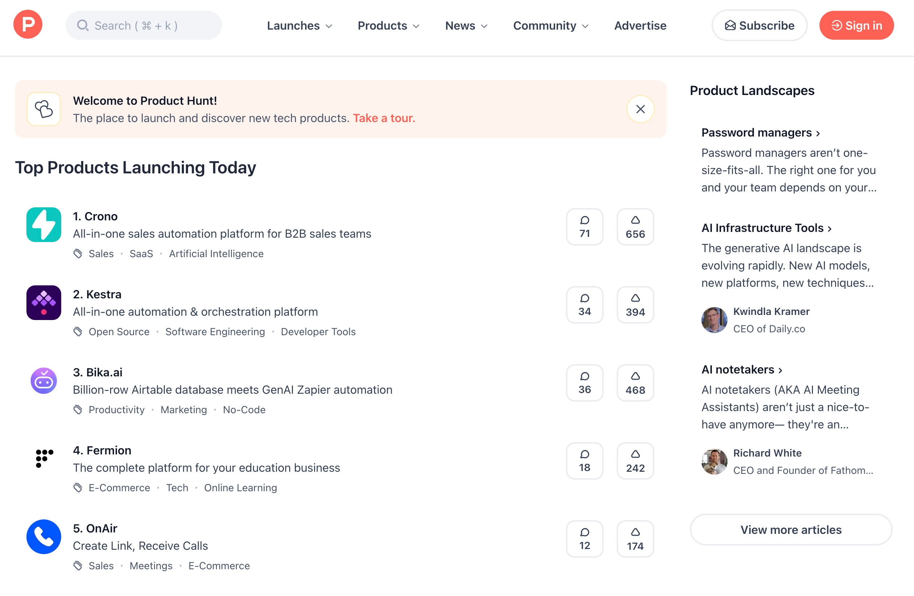
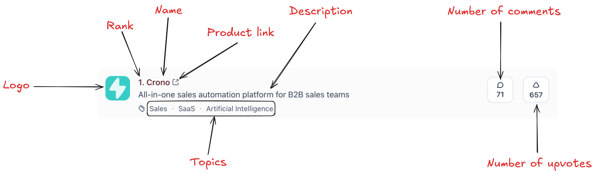
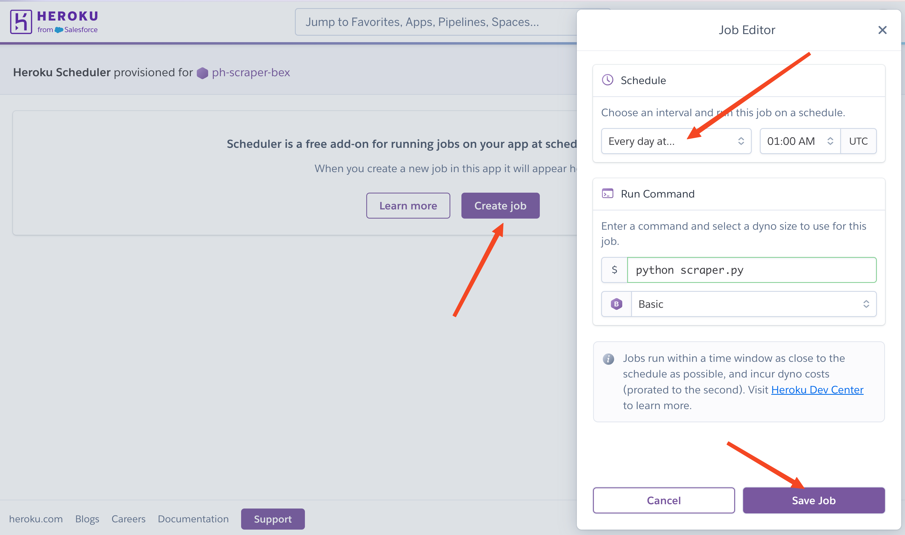
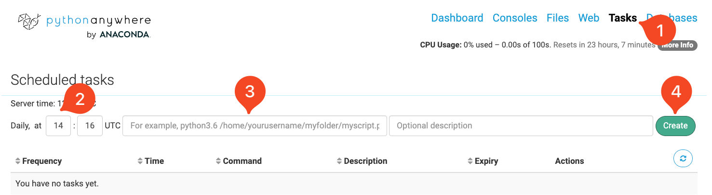

## Introduction

Web scraping projects may start on your machine, but unless you're willing to ship your laptop to random strangers on the Internet, you'll need cloud services.


There are many compelling reasons to move web scrapers to the cloud and make them more reliable. This guide explores several methods for automating and deploying web scrapers in 2025, focusing on free solutions.

Here is a general outline of concepts we will cover:

- Setting up automated scraping with GitHub Actions
- Deploying to PaaS platforms (Heroku, PythonAnywhere)
- Best practices for monitoring, security, and optimization

## Why Move Web Scrapers to the Cloud?

The number one reason to deploy scrapers to the cloud is reliability. Cloud-based scrapers run 24/7, without cigarette breaks and the best part, without depending on your local machine.

Cloud-based scrapers also handle large-scale data operations more easily and gracefully, often juggling multiple scraping tasks. And, if you are a bit more aggressive in your request frequencies and get a dreaded IP ban, cloud services can give access to other IP addresses and geographic locations.

Moreover, you are not limited by your laptop's specs because cloud gives you dedicated resources. While these resources may gouge a hole in your pocket for large-scale scraping operations, many platforms offer generous free tiers, as we will explore soon.

## How to Choose the Right Deployment Method For Your Scrapers

We are about to list three deployment methods in this article, so you might get a decision fatigue. To prevent that, give this section a cursory read as it helps you choose the right one based on your scale requirements, technical complexity, and budget.

### Scale requirements

In this section, we'll dive into three deployment tiers that match your scale - from lightweight solutions to heavy-duty scraping powerhouses.

#### Small scale (1-1000 requests/day)

- **Best Options**:
  - GitHub Actions
  - PythonAnywhere
  - Heroku (Free Tier)
- **Why**: These platforms offer sufficient resources for basic scraping needs without cost
- **Limitations**: Daily request caps and runtime restrictions

#### Medium Scale (1000-10000 requests/day)

- **Best Options**:
  - AWS Lambda
  - Google Cloud Functions
  - Docker containers on basic VPS
- **Why**: Better handling of concurrent requests and flexible scaling
- **Considerations**: Cost begins to factor in, but still manageable

#### Large Scale (10000+ requests/day)

- **Best Options**:
  - Kubernetes clusters
  - Multi-region serverless deployments
  - Specialized scraping platforms
- **Why**: Robust infrastructure for high-volume operations
- **Trade-offs**: Higher complexity and cost vs. reliability

### Technical complexity

Now, let's categorize the methods based on how fast you can get them up and running.

#### Low Complexity Solutions

- **GitHub Actions**
  - Pros: Simple setup, version control integration
  - Cons: Limited customization
- **PythonAnywhere**
  - Pros: User-friendly interface
  - Cons: Resource constraints

#### Medium Complexity Solutions

- **Serverless (AWS Lambda/Google Functions)**
  - Pros: Managed infrastructure, auto-scaling
  - Cons: Learning curve for configuration
- **Docker Containers**
  - Pros: Consistent environments
  - Cons: Container management overhead

#### High Complexity Solutions

- **Kubernetes**
  - Pros: Ultimate flexibility and scalability
  - Cons: Significant operational overhead
- **Custom Infrastructure**
  - Pros: Complete control
  - Cons: Requires DevOps expertise

### Budget Considerations

In terms of cost, all methods in the article has the following generous free tiers or next-to-nothing cheap starting plans:

- GitHub Actions: 2000 minutes/month
- Heroku: $5 and up
- AWS Lambda: starting at 0.2$ per 1 million requests
- Google Cloud Functions: 2 million invocations/month

These limits are based on various cost factors like compute time, data transfer speeds, storage requirements and additional services like databases or monitoring.

Here is a little decision matrix to distill all this information:

| Factor          | Small Project | Medium Project | Large Project |
|-----------------|---------------|----------------|---------------|
| Best Platform   | GitHub Actions| AWS Lambda     | Kubernetes   |
| Monthly Cost    | $0           | $10-50         | $100+        |
| Setup Time      | 1-2 hours    | 1-2 days       | 1-2 weeks    |
| Maintenance     | Minimal      | Moderate       | Significant  |
| Scalability     | Limited      | Good           | Excellent    |

-------------

Start small with simpler platforms and gather data on your scraping needs by measuring actual usage patterns. From there, you can gradually scale and potentially implement hybrid approaches that balance complexity and benefits.

## Prerequisites

This article assumes familiarity with web scraping fundamentals like HTML parsing, CSS selectors, HTTP requests, and handling dynamic content. You should also be comfortable with Python basics including functions, loops, and working with external libraries. Basic knowledge of command line tools and git version control will be essential for deployment.

### Required accounts

Before starting with any deployment method, you'll need to create accounts on these platforms:

1. **[GitHub account](github.com)** (Required)
   - Needed for version control and GitHub Actions
2. **Cloud Platform Account** (Choose at least one)
   - [Heroku account](https://signup.heroku.com/)
   - [PythonAnywhere account](https://www.pythonanywhere.com/)

3. **[Firecrawl account](https://firecrawl.dev)** (Optional)
   - Only needed if you decide to use an AI-based scraper (more on Firecrawl soon).  

Note: Most cloud platforms require a credit card for verification, even when using free tiers. However, they won't charge you unless you exceed free tier limits.

### Building a basic scraper

To demonstrate deployment concepts effectively, we'll start by building a basic web scraper using Firecrawl, a modern scraping API that simplifies many common challenges.

[Firecrawl](https://docs.firecrawl.dev) offers several key advantages compared to traditional Python web scraping libraries:

- Dead simple to use with only a few dependencies
- Handles complex scraping challenges automatically (proxies, anti-bot mechanisms, dynamic JS content)
- Converts web content into clean, LLM-ready markdown format
- Supports multiple output formats (markdown, structured data, screenshots, HTML)
- Reliable extraction with retry mechanisms and error handling
- Supports custom actions (click, scroll, input, wait) before data extraction
- Geographic location customization for avoiding IP bans
- Built-in rate limiting and request management

As an example, we will build a simple scraper for [ProductHunt](https://www.producthunt.com/). Specifically, we will scrape the "Yesterday's Top Products" list from the homepage:



The scraper extracts the following information from each product:



Let's get building:

```bash
mkdir product-hunt-scraper
cd product-hunt-scraper
touch scraper.py .env
python -m venv venv
source venv/bin/activate
pip install pydantic firecrawl-py
echo "FIRECRAWL_API_KEY='your-api-key-here' >> .env"
```

These commands set up a working directory for the scraper, along with a virtual environment and the main script. The last part also saves your Firecrawl API key, which you can get through their free plan by [signing up for an account](firecrawl.dev).

Let's work on the code now:

```python
import json

from firecrawl import FirecrawlApp
from dotenv import load_dotenv
from pydantic import BaseModel, Field
from datetime import datetime

load_dotenv()
```

First, we import a few packages and the `FirecrawlApp` class - we use it to establish a connection with Firecrawl's scraping engine. Then, we define a Pydantic class outlining the details we want to scrape from each product:

```python
class Product(BaseModel):
    name: str = Field(description="The name of the product")
    description: str = Field(description="A short description of the product")
    url: str = Field(description="The URL of the product")
    
    topics: list[str] = Field(
        description="A list of topics the product belongs to. Can be found below the product description."
    )
    
    n_upvotes: int = Field(description="The number of upvotes the product has")
    n_comments: int = Field(description="The number of comments the product has")
    
    rank: int = Field(
        description="The rank of the product on Product Hunt's Yesterday's Top Products section."
    )
    logo_url: str = Field(description="The URL of the product's logo.")
```

The field descriptions in this class play a crucial role in guiding the LLM scraping engine. By providing natural language descriptions for each field, we tell the LLM exactly what information to look for and where to find it on the page. For example, when we say "A list of topics under the product description", the LLM understands both the content we want (topics) and its location (below the description).

This natural language approach allows Firecrawl to intelligently parse the page's HTML structure and extract the right information without requiring explicit CSS selectors or XPaths. The LLM analyzes the semantic meaning of our descriptions and matches them to the appropriate elements on the page.

This approach offers two practical advantages: it reduces initial development time since you don't need to manually inspect HTML structures, and it provides long-lasting resilience against HTML changes. Since the LLM understands the semantic meaning of the elements rather than relying on specific selectors, it can often continue working even when class names or IDs are updated. This makes it suitable for scenarios where long-term maintenance is a consideration.

Getting back to code, we write another Pydantic class for scraping a collection of Products from the 'Yesterday's Top Products' list:

```python
class YesterdayTopProducts(BaseModel):
    products: list[Product] = Field(
        description="A list of top products from yesterday on Product Hunt."
    )
```

The `YesterdayTopProducts` parent class is essential - without it, Firecrawl would only scrape a single product instead of the full list. This happens because Firecrawl strictly adheres to the provided schema structure, ensuring consistent and reliable output on every scraping run.

Now, we define a function that scrapes ProductHunt based on the schema we just defined:

```python
BASE_URL = "https://www.producthunt.com"


def get_yesterday_top_products():
    app = FirecrawlApp()

    data = app.scrape_url(
        BASE_URL,
        params={
            "formats": ["extract"],
            "extract": {
                "schema": YesterdayTopProducts.model_json_schema(),
                
                "prompt": "Extract the top products listed under the 'Yesterday's Top Products' section. There will be exactly 5 products.",
            },
        },
    )

    return data["extract"]["products"]
```

This function initializes a Firecrawl app, which reads your Firecrawl API key stored in an `.env` file and scrapes the URL. Notice the parameters being passed to the `scrape_url()` method:

- `formats` specifies how the data should be scraped and extracted. Firecrawl supports other formats like markdown, HTML, screenshots or links.
- `schema`: The JSON schema produced by the Pydantic class
- `prompt`: A general prompt guiding the underlying LLM on what to do. Providing a prompt usually improves the performance.

In the end, the function returns the extracted products, which will be a list of dictionaries.

The final step is writing a function to save this data to a JSON file:

```python
def save_yesterday_top_products():
    products = get_yesterday_top_products()
    
    date_str = datetime.now().strftime("%Y_%m_%d")
    filename = f"ph_top_products_{date_str}.json"
    
    with open(filename, "w") as f:
        json.dump(products, f)
        
if __name__ == "__main__":
    save_yesterday_top_products()
```

This function runs the previous one and saves the returned data to a JSON file identifiable with the following day's date.

-------------

We've just built a scraper that resiliently extracts data from ProductHunt. To keep things simple, we implemented everything in a single script with straightforward data persistence. In production environments with larger data flows and more complex websites, your project would likely span multiple directories and files.

Nevertheless, the deployment methods we'll explore work for nearly any type of project. You can always restructure your own projects to follow this pattern of having a single entry point that coordinates all the intermediate scraping stages.

## Deploying Web Scrapers With GitHub Actions

GitHub Actions is a powerful CI/CD platform built into GitHub that allows you to automate workflows, including running scrapers on a schedule. It provides a simple way to deploy and run automated tasks without managing infrastructure, making it an ideal choice for web scraping projects.

To get started, initialize Git and commit the work we've completed so far in your working directory:

```python
git init
touch .gitignore
echo ".env" >> .gitignore  # Remove the .env file from Git indexing
git add .
git commit -m "Initial commit"
```

Then, create an empty GitHub repository, copy its link and set it as the remote for your local repo:

```bash
git remote add origin your-repo-link
git push
```

### Creating workflow files

Workflow files are YAML configuration files that tell GitHub Actions how to automate tasks in your repository. For our web scraping project, these files will define when and how to run our scraper.

These files live in the `.github/workflows` directory of your repository and contain instructions for:

- When to trigger the workflow (like on a schedule or when code is pushed)
- What environment to use (Python version, dependencies to install)
- The actual commands to run your scraper
- What to do with the scraped data

Each workflow file acts like a recipe that GitHub Actions follows to execute your scraper automatically. This automation is perfect for web scraping since we often want to collect data on a regular schedule without manual intervention.

For our scraper, we need a single workflow file that executes the `scraper.py` file. Let's set it up:

```bash
mkdir -p .github/workflows
touch .github/workflows/ph-scraper.yml
```

Open the newly-created file and paste the following contents:

```yml
name: Product Hunt Scraper

on:
  schedule:
    - cron: '0 1 * * *'  # Runs at 1 AM UTC daily
  workflow_dispatch:  # Allows manual trigger

permissions:
  contents: write

jobs:
  scrape:
    runs-on: ubuntu-latest
    
    steps:
    - name: Checkout repository
      uses: actions/checkout@v3
      with:
          persist-credentials: true
      
    - name: Set up Python
      uses: actions/setup-python@v4
      with:
        python-version: '3.10'
        
    - name: Install dependencies
      run: |
        python -m pip install --upgrade pip
        pip install -r requirements.txt
        
    - name: Run scraper
      env:
        FIRECRAWL_API_KEY: ${{ secrets.FIRECRAWL_API_KEY }}
      run: python scraper.py
        
    - name: Commit and push if changes
      run: |
        git config --local user.email "github-actions[bot]@users.noreply.github.com"
        git config --local user.name "github-actions[bot]"
        git add *.json
        git diff --quiet && git diff --staged --quiet || git commit -m "Update ProductHunt data [skip ci]"
        git push
```

The YAML file defines a GitHub Actions workflow for automated web scraping:

name: Specifies the workflow name that appears in GitHub Actions UI

on: Defines how workflow triggers:

- schedule: Uses cron syntax to run daily at 1 AM UTC
- workflow_dispatch: Enables manual workflow triggering

jobs: Contains the workflow jobs:

- scrape: Main job that runs on ubuntu-latest
  - steps: Sequential actions to execute:
    1. Checkout repository using `actions/checkout`
    2. Setup Python 3.10 environment
    3. Install project dependencies from `requirements.txt`
    4. Run the scraper with environment variables
    5. Commit and push any changes to the repository

The workflow automatically handles repository interaction, dependency management, and data updates while providing both scheduled and manual execution options. You can read the [official GitHub guide on workflow file syntax](https://docs.github.com/en/actions/writing-workflows/workflow-syntax-for-github-actions#about-yaml-syntax-for-workflows) to learn more.

For this workflow file to sun successfully, we need to take a couple of additional steps.

### Generating a `requirements.txt` file

One of the steps in the workflow file is installing the dependencies for our project using a `requirements.txt` file, which is a standard format for listing packages used in your project.

For simple projects, you can create this file manually and adding each package on a new line like:

```text
pydantic
firecrawl-py
```

However, if you have a large project with multiple files and dozens of dependencies, you need an automated method. The simplest one I can suggest is using `pipreqs` package:

```bash
pip install pipreqs
pipreqs . 
```

`pipreqs` is a lightweight package that scans all Python scripts in your project and adds them to a new `requirements.txt` file with their used versions.

### Storing secrets

If you notice, the workflow file has a step that executes `scraper.py`:

```yml
- name: Run scraper
      env:
        FIRECRAWL_API_KEY: ${{ secrets.FIRECRAWL_API_KEY }}
      run: python scraper.py
```

The workflow retrieves environment variables using the `secrets.SECRET_NAME` syntax. Since the `.env` file containing your Firecrawl API key isn't uploaded to GitHub for security reasons, you'll need to store the key in your GitHub repository secrets.

To add your API key as a secret:

1. Navigate to your GitHub repository
2. Click on "Settings"
3. Select "Secrets and variables" then "Actions"
4. Click "New repository secret"
5. Enter "FIRECRAWL_API_KEY" as the name
6. Paste your API key as the value
7. Click "Add secret"

This allows the workflow to securely access your API key during execution without exposing it in the repository.

### Running the workflow

Before running the workflow, we need to commit all new changes and push them to GitHub:

```python
git add .
git commit -m "Descriptive commit message"
```

This makes our workflow visible to GitHub.

At the top of the workflow file, we set a schedule for the workflow file to run at 1 AM using `cron` syntax:

```yaml
on:
  schedule:
    - cron: '0 1 * * *'  # Runs at 1 AM UTC daily
  workflow_dispatch:  # Allows manual trigger
```

The `cron` syntax consists of 5 fields representing minute (0-59), hour (0-23), day of month (1-31), month (1-12), and day of week (0-6, where 0 is Sunday). Each field can contain specific values, ranges (1-5), lists (1,3,5), or asterisks (*) meaning "every". For example, `0 1 * * *` means "at minute 0 of hour 1 (1 AM UTC) on every day of every month". Here are some more patterns:

- `0 */2 * * *`: Every 2 hours
- `0 9-17 * * 1-5`: Every hour from 9 AM to 5 PM on weekdays
- `*/15 * * * *`: Every 15 minutes
- `0 0 * * 0`: Every Sunday at midnight
- `0 0 1 * *`: First day of every month at midnight
- `30 18 * * 1,3,5`: Monday, Wednesday, Friday at 6:30 PM

So, once the workflow file is pushed to GitHub, the scraper is scheduler to run. However, the `workflow_dispatch` parameter in the file allows us to run the scraper manually for debugging.


Navigate to the Actions tab of your GitHub repository, click on the workflow name and press "Run workflow". In about a minute (if the workflow is successful), you will see the top five products from yesterday on ProductHunt saved as a JSON file to your repository.

Whenever you want to interrupt the scraping schedule, click on the three buttons in the top-right corner of the workflow page and disable it.

## Deploying Web Scrapers With Heroku

[Heroku](heroku.com) is a Platform-as-a-Service (PaaS) that makes deploying applications straightforward, even for beginners. While it removed its generous free tier in 2022, its basic $5 "dyno" plan still has some free features we can take advantage of for the purposes of this tutorial.

### Setting up Heroku

First, install the Heroku CLI and login to your account:

```bash
brew install heroku/brew/heroku  # macOS
curl https://cli-assets.heroku.com/install.sh | sh  # Linux
heroku login  # Opens your web browser
```

Then, create a new Heroku app and set it as a remote for your repository:

```bash
heroku create ph-scraper-your-name  # Make the app name unique
heroku git:remote -a ph-scraper-your-name
```

After this step, if you visit [dashboard.heroku.com](dashboard.heroku.com), your app must be visible.

### Configuring the Application

Heroku requires a few additional files to run your application. First, create a `Procfile` that tells Heroku what command to run:

```bash
touch Procfile
echo "worker: python scraper.py" > Procfile
```

Next, create a `runtime.txt` to specify the Python version:

```bash
touch runtime.txt
echo "python-3.10.12" > runtime.txt
```

### Environment Variables

Instead of using a `.env` file, Heroku requires you to set your environment variables directly using the Heroku CLI:

```bash
heroku config:set FIRECRAWL_API_KEY='your-api-key-here'
```

You can verify the variables are set correctly with:

```bash
heroku config
```

### Scheduling Scraper Runs

Heroku uses an add-on called ["Scheduler"](https://elements.heroku.com/addons/scheduler) for running periodic tasks. Install it with:

```bash
heroku addons:create scheduler:standard
```

Then open the scheduler dashboard:

```bash
heroku addons:open scheduler
```

In the web interface, add a new job with the command `python scraper.py` and set your desired frequency (daily, hourly, or every 10 minutes).



### Deployment and Monitoring

Now, to launch everything, you need to deploy your application by committing and pushing the local changes to Heroku:

```bash
git add .
git commit -m "Add Heroku-related files"
git push heroku main
```

You can periodically monitor the health of your application with the following command:

```bash
heroku logs --tail
```

### Platform Limitations

The basic $5 dyno has some important limitations to consider:

- Sleeps after 30 minutes of inactivity
- Limited to 512MB RAM
- Shares CPU with other applications
- Maximum of 23 hours active time per day

For most small to medium scraping projects, these limitations aren't problematic. However, if you need more resources, you can upgrade to Standard ($25/month) or Performance ($250/month) dynos.

### Data Persistence

Since Heroku's filesystem is temporary, you'll need to modify the scraper to store data externally. Here's a quick example using AWS S3:

```python
import boto3  # pip install boto3
from datetime import datetime

def save_yesterday_top_products():
    products = get_yesterday_top_products()
    
    # Initialize S3 client
    s3 = boto3.client('s3')
    
    # Create filename with date
    date_str = datetime.now().strftime("%Y_%m_%d")
    filename = f"ph_top_products_{date_str}.json"
    
    # Upload to S3
    s3.put_object(
        Bucket='your-bucket-name',
        Key=filename,
        Body=json.dumps(products)
    )
```

For this to work, you must already have an AWS account and an existing S3 bucket. Also, you must set your AWS credentials as Heroku secrets through the Heroku CLI:

```bash
heroku config:set AWS_ACCESS_KEY_ID='your-key'
heroku config:set AWS_SECRET_ACCESS_KEY='your-secret'
```

Once you do, add `boto3` to the list of dependencies in your `requirements.txt` file:

```bash
echo "boto3" >> requirements.txt
```

Finally, commit and push the changes:

```bash
git add .
git commit -m "Switch data persistence to S3"
git push heroku main
git push origin main
```

You can confirm that the app is functioning properly by setting the schedule frequency to 10 minutes and checking your S3 bucket for the JSON file containing the top five products from ProductHunt.

### Stopping Heroku Apps

To stop your app, you can use a few different methods:

- Pause the dyno:

```bash
heroku ps:scale worker=0
```

This stops the worker dyno without deleting the app. To resume later:

```bash
heroku ps:scale worker=1
```

- Disable the scheduler:

```bash
heroku addons:destroy scheduler
```

Or visit the Heroku dashboard and remove the scheduler add-on manually.

- Delete the entire app:

```bash
heroku apps:destroy --app your-app-name --confirm your-app-name
```

⚠️ Warning: This permanently deletes your app and all its data.

- Maintenance mode

```bash
heroku maintenance:on
```

This puts the app in maintenance mode. To disable:

```bash
heroku maintenance:off
```

-------------

To learn more about Heroku and how to run Python applications on its servers, please refer to [their Python support documentation](https://devcenter.heroku.com/categories/python-support).

## Deploying Web Scrapers With PythonAnywhere

[PythonAnywhere](https://www.pythonanywhere.com/) is a cloud-based Python development environment that offers an excellent platform for hosting web scrapers. It provides a free tier that includes:

- Daily scheduled tasks
- Web-based console access
- 512MB storage
- Basic CPU and memory allocation

### Setting Up PythonAnywhere

First, create a free account at [pythonanywhere.com](https://www.pythonanywhere.com). Once logged in, follow these steps:

Open a Bash console from your PythonAnywhere dashboard and execute these commands to clone the GitHub repository we've been building:

```bash

$ git clone https://github.com/your-username/your-repo.git
$ cd your-repo
$ python3 -m venv venv
$ source venv/bin/activate
$ pip install -r requirements.txt

# Recreate your .env file
$ touch .env
$ echo "FIRECRAWL_API_KEY='your-api-key-here'" >> .env
```

### Scheduling the Scraper

PA free tier includes a scheduler with a daily frequency. To enable it, follow these steps:

1. Go to the "Tasks" tab in your PythonAnywhere dashboard accessible via <https://www.pythonanywhere.com/user/your-username/>
2. Add a new scheduled task.
3. Set the timing using the provided interface.
4. Enter the command to run your scraper:

```bash
cd /home/your-username/your-repo && source venv/bin/activate && python scraper.py
```

The command changes the working directory to the project location, activates the virtual environment and executes the scraper.



### Data Storage Options

PythonAnywhere's filesystem is persistent, unlike Heroku, so you can store JSON files directly. However, for better scalability, consider using cloud storage:

```python
def save_yesterday_top_products():
    """
    Change back to JSON-based storage.
    """
    products = get_yesterday_top_products()
    
    # Local storage (works on PythonAnywhere)
    date_str = datetime.now().strftime("%Y_%m_%d")
    filename = f"data/ph_top_products_{date_str}.json"
    
    # Create data directory if it doesn't exist
    os.makedirs("data", exist_ok=True)
    
    with open(filename, "w") as f:
        json.dump(products, f)
```

### Platform benefits & limitations

PythonAnywhere offers several advantages for web scraping:

- **Always-on environment**: Unlike Heroku's free tier, PythonAnywhere doesn't sleep
- **Persistent storage**: Files remain stored between runs
- **Simple interface**: User-friendly web console and file editor
- **Built-in scheduler**: No need for additional add-ons
- **Free SSL**: HTTPS requests work out of the box
- **Multiple Python Versions**: Support for different Python versions

The free tier has some restrictions:

- Limited to 1 daily task
- CPU/RAM throttling
- 512MB storage limit

### Stopping or Modifying Tasks

To manage your scraper:

1. **Pause**: Disable the scheduled task in the Tasks tab
2. **Modify schedule**: Edit timing in the Tasks interface
3. **Delete**: Remove the task completely
4. **Update code**: Pull latest changes from git repository from any PythonAnywhere bash console:

```bash
cd your-repo
git pull origin main
```

## Best Practices and Optimization

Our scraper and deployment methods are far from perfect. In this section, we will cover some best practices and tips to optimize its performance.

### Error Handling & Monitoring

Proper error handling and monitoring are crucial for maintaining a reliable web scraper. Below, we will implement a few mechanisms.

#### Implement a robust retry mechanism

```python
from tenacity import retry, stop_after_attempt, wait_exponential

@retry(
    stop=stop_after_attempt(3),
    wait=wait_exponential(multiplier=1, min=4, max=10),
    reraise=True
)
def get_yesterday_top_products():
    try:
        app = FirecrawlApp()
        data = app.scrape_url(
            BASE_URL,
            params={
                "formats": ["extract"],
                "extract": {
                    "schema": YesterdayTopProducts.model_json_schema(),
                    "prompt": "Extract the top products listed under the 'Yesterday's Top Products' section."
                },
            },
        )
        return data["extract"]["products"]
    except Exception as e:
        logger.error(f"Scraping failed: {str(e)}")
        raise
```

Above, we are implementing a retry mechanism using the tenacity library. It will retry the scraping operation up to 3 times with exponential backoff between attempts. The wait time starts at 4 seconds and increases exponentially up to 10 seconds between retries. If all retries fail, it will raise the last exception. Any errors are logged before being re-raised to trigger the retry mechanism.

#### Implement comprehensive logging

```python
import logging
from datetime import datetime

def setup_logging():
    """Configure logging with both file and console handlers."""
    logger = logging.getLogger(__name__)
    logger.setLevel(logging.INFO)

    # Create formatters
    detailed_formatter = logging.Formatter(
        '%(asctime)s - %(name)s - %(levelname)s - %(message)s'
    )
    simple_formatter = logging.Formatter('%(levelname)s: %(message)s')

    # File handler
    file_handler = logging.FileHandler(
        f'logs/scraper_{datetime.now().strftime("%Y%m%d")}.log'
    )
    file_handler.setFormatter(detailed_formatter)
    
    # Console handler
    console_handler = logging.StreamHandler()
    console_handler.setFormatter(simple_formatter)

    # Add handlers
    logger.addHandler(file_handler)
    logger.addHandler(console_handler)

    return logger

logger = setup_logging()
```

The logging setup above configures comprehensive logging for our web scraper, which is essential for monitoring, debugging and maintaining the scraper in production. It creates two logging handlers - one that writes detailed logs to dated files (including timestamps and log levels), and another that outputs simplified logs to the console. This dual logging approach helps us track scraper execution both in real-time via console output and historically through log files. Having proper logging is crucial for diagnosing issues, monitoring performance, and ensuring the reliability of our web scraping system.

#### Set up monitoring alerts

```python
import requests

def send_alert(message, webhook_url):
    """Send alerts to Slack/Discord/etc."""
    payload = {"text": message}
    try:
        requests.post(webhook_url, json=payload)
    except Exception as e:
        logger.error(f"Failed to send alert: {str(e)}")

def monitor_scraping_health(products):
    """Monitor scraping health and send alerts if needed."""
    if not products:
        send_alert(
            "⚠️ Warning: No products scraped from ProductHunt",
            os.getenv("WEBHOOK_URL")
        )
        return False
        
    if len(products) < 5:
        send_alert(
            f"⚠️ Warning: Only {len(products)} products scraped (expected 5)",
            os.getenv("WEBHOOK_URL")
        )
        return False
        
    return True
```

The monitoring functions above help ensure our scraper is working properly. The `send_alert()` function sends notifications to messaging platforms like Slack or Discord when issues occur, requiring a webhook URL configured in environment variables. The `monitor_scraping_health()` function checks if we're getting the expected amount of scraped data and triggers alerts if not. Learn more about setting up webhooks in [Discord](https://discord.com/developers/docs/resources/webhook) and [Slack](https://api.slack.com/messaging/webhooks).

### Data Management

Proper data management is crucial for a production web scraper. This includes validating the scraped data to ensure quality and consistency, as well as implementing efficient storage mechanisms to handle large volumes of data. Let's look at the key components.

#### Implement data validation

```python
from typing import Optional
from datetime import datetime

class ProductValidator:
    @staticmethod
    def validate_product(product: dict) -> Optional[str]:
        """Validate product data and return error message if invalid."""
        required_fields = ['name', 'description', 'url', 'topics']
        
        for field in required_fields:
            if not product.get(field):
                return f"Missing required field: {field}"
                
        if not isinstance(product.get('n_upvotes'), int):
            return "Invalid upvote count"
            
        if not product.get('url').startswith('http'):
            return "Invalid URL format"
            
        return None

def validate_products(products: list) -> list:
    """Validate and filter products."""
    valid_products = []
    
    for product in products:
        error = ProductValidator.validate_product(product)
        if error:
            logger.warning(f"Invalid product data: {error}")
            continue
        valid_products.append(product)
    
    return valid_products
```

A class like `ProductValidator` is important for ensuring data quality and consistency in our web scraping pipeline. It validates product data against required fields and format specifications before storage. This validation step helps prevent corrupted or incomplete data from entering our system, making downstream processing more reliable. The class provides static methods to validate individual products and entire product lists, checking for required fields like name and description, proper URL formatting, and valid upvote counts.

#### Implement efficient storage

```python
import json
import gzip
from pathlib import Path

class DataManager:
    def __init__(self, base_dir: str = "data"):
        self.base_dir = Path(base_dir)
        self.base_dir.mkdir(exist_ok=True)

    def save_products(self, products: list, compress: bool = True):
        """Save products with optional compression."""
        date_str = datetime.now().strftime("%Y_%m_%d")
        
        if compress:
            filename = self.base_dir / f"ph_products_{date_str}.json.gz"
            with gzip.open(filename, 'wt', encoding='utf-8') as f:
                json.dump(products, f)
        else:
            filename = self.base_dir / f"ph_products_{date_str}.json"
            with open(filename, 'w', encoding='utf-8') as f:
                json.dump(products, f)

    def load_products(self, date_str: str) -> list:
        """Load products for a specific date."""
        gz_file = self.base_dir / f"ph_products_{date_str}.json.gz"
        json_file = self.base_dir / f"ph_products_{date_str}.json"
        
        if gz_file.exists():
            with gzip.open(gz_file, 'rt', encoding='utf-8') as f:
                return json.load(f)
        elif json_file.exists():
            with open(json_file, 'r', encoding='utf-8') as f:
                return json.load(f)
        return []
```

The `DataManager` class extends our plain storage function from the previous sections. It provides a robust and organized way to handle data persistence for our web scraper. The class implements both compressed and uncompressed storage options using `gzip`, which helps optimize disk space usage while maintaining data accessibility. By organizing data by date and providing consistent file naming conventions, it enables easy tracking and retrieval of historical product data.

## Conclusion

And that's a wrap! We've covered several ways to deploy web scrapers in 2025, from simple GitHub Actions to more complex setups with Heroku and PythonAnywhere. Each method has its own sweet spot:

- GitHub Actions: Great for simple scrapers that run daily/weekly
- Heroku: Perfect for more frequent scraping with its flexible scheduler
- PythonAnywhere: Solid choice for beginners with its user-friendly interface

Remember, start small and scale up as needed. No need to jump straight into complex setups if GitHub Actions does the job. The best deployment method is the one that matches your specific needs and technical comfort level. 🕷️

Here are some related resources that might interest you:

- [GitHub Actions documentation](https://docs.github.com/en/actions)
- [Firecrawl documentation](docs.firecrawl.dev)
- [Comprehensive guide on Firecrawl's `scrape_url` method](https://www.firecrawl.dev/blog/mastering-firecrawl-scrape-endpoint)
- [How to generate sitemaps in Python using Firecrawl](https://www.firecrawl.dev/blog/how-to-generate-sitemaps-using-firecrawl-map-endpoint)

Thank you for reading!
